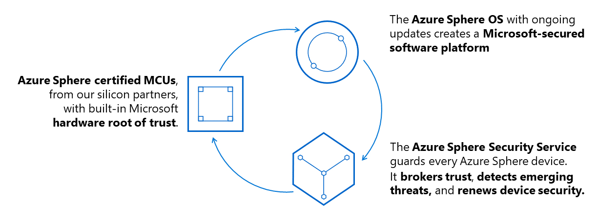

---

**Follow** me on **Twitter** [@dglover](https://twitter.com/dglover)

|Author|[Dave Glover](https://developer.microsoft.com/en-us/advocates/dave-glover?WT.mc_id=github-blog-dglover), Microsoft Cloud Developer Advocate |
|:----|:---|
|Target Platform | Seeed Studio Azure Sphere MT3620 |
|Target Service | [Azure IoT Central](https://azure.microsoft.com/services/iot-central/?WT.mc_id=github-blog-dglover) |
|Developer Platform | Windows 10 or Ubuntu 18.04 |
|Azure SDK | Azure Sphere SDK 19.11 or better |
|Developer Tools| [Visual Studio (The free Community Edition or better)](https://visualstudio.microsoft.com/vs/?WT.mc_id=github-blog-dglover) or [Visual Studio Code (Free OSS)](https://code.visualstudio.com?WT.mc_id=github-blog-dglover)|
|Hardware | [Seeed Studio Grove Shield](https://www.seeedstudio.com/MT3620-Grove-Shield.html), and the [Grove Temperature and Humidity Sensor (SHT31)](https://www.seeedstudio.com/Grove-Temperature-Humidity-Sensor-SHT31.html) |
|Source Code | https://github.com/gloveboxes/Azure-Sphere-Learning-Path.git |
|Language| C|
|Date| January  2020|

---

## Azure Sphere Learning Path

Each module assumes you have completed the previous module.

* Lab 0: [Introduction Azure Sphere and Lab Set Up](https://github.com/gloveboxes/Azure-Sphere-Learning-Path/tree/master/Lab%200%20-%20Introduction%20and%20Lab%20Set%20Up)
* Lab 1: [Build your first Azure Sphere Application with Visual Studio](https://github.com/gloveboxes/Azure-Sphere-Learing-Path/tree/master/Lab%201%20-%20Build%20your%20first%20Azure%20Sphere%20Application%20with%20Visual%20Studio)
* Lab 2: [Send Telemetry from an Azure Sphere to Azure IoT Central](https://github.com/gloveboxes/Azure-Sphere-Learing-Path/tree/master/Lab%202%20-%20Send%20Telemetry%20from%20an%20Azure%20Sphere%20to%20Azure%20IoT%20Central)
* Lab 3: [Control an Azure Sphere with Device Twins and Direct Methods](https://github.com/gloveboxes/Azure-Sphere-Learing-Path/tree/master/Lab%203%20-%20Control%20an%20Azure%20Sphere%20with%20Device%20Twins%20and%20Direct%20Methods)
* Lab 4: [Azure Sphere Inter-Core Communications](https://github.com/gloveboxes/Azure-Sphere-Learing-Path/tree/master/Lab%204%20-%20Azure%20Sphere%20Inter-Core%20Communications)
* Lab 5: [Automating Azure Sphere Registration with Azure IoT Central](https://github.com/gloveboxes/Azure-Sphere-Learing-Path/tree/master/Lab%205%20-%20Automating%20Azure%20Sphere%20Registration%20with%20Azure%20IoT%20Central)

---

## What is Azure Sphere

Azure Sphere is a solution for securing MCU Power Devices. It comprises a secured, connected, crossover microcontroller unit (MCU), a custom high-level Linux-based operating system (OS), and a cloud-based security service that provides continuous, renewable security.

Growing ecosystem of hardware partners.

---

## Why Azure Sphere

As billions of new devices are connected, organizations need to secure them to help protect data, privacy, physical safety, and infrastructure. Azure Sphere builds on decades of Microsoft experience in hardware, software, and cloud to provide a turnkey solution for IoT devices. Get defense in depth to embrace IoT innovation with confidence.

---

## Hardware Required

This tutorial requires the [Seeed Studio Azure Sphere](https://www.seeedstudio.com/Azure-Sphere-MT3620-Development-Kit-US-Version-p-3052.html), the [Seeed Studio Grove Shield](https://www.seeedstudio.com/MT3620-Grove-Shield.html), and the [Grove Temperature and Humidity Sensor (SHT31)](https://www.seeedstudio.com/Grove-Temperature-Humidity-Sensor-SHT31.html). These parts are available from many online stores including [Seeed Studio](www.seeedstudio.com).

Be sure to plug the Grove Temperature Sensor into one of the I2C connectors on the Grove Shield.

