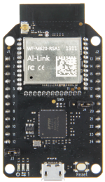
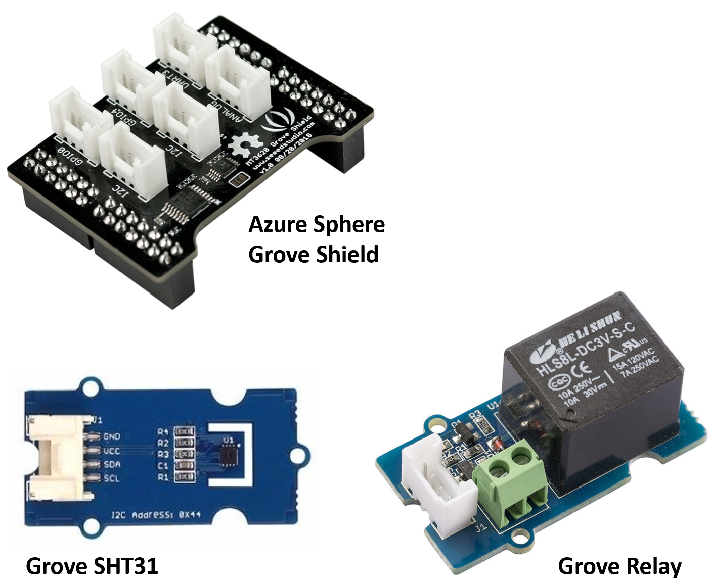
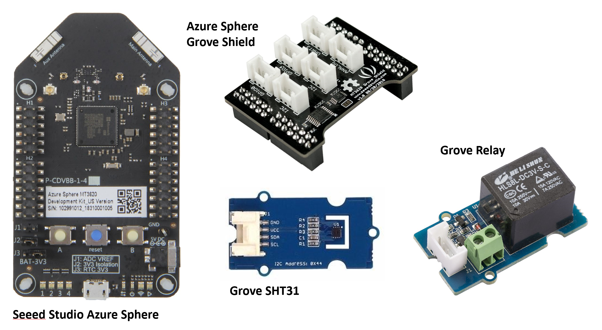

---

**Follow** me on **Twitter** [@dglover](https://twitter.com/dglover)

|Author|[Dave Glover](https://developer.microsoft.com/en-us/advocates/dave-glover?WT.mc_id=github-blog-dglover), Microsoft Cloud Developer Advocate |
|:----|:---|
|Target Platform | Azure Sphere MT3620 |
|Target Service | [Azure IoT Central](https://azure.microsoft.com/services/iot-central/?WT.mc_id=github-blog-dglover) |
|Developer Platform | Windows 10 or Ubuntu 18.04 |
|Azure SDK | Azure Sphere SDK 20.01 or better |
|Developer Tools| [Visual Studio (The free Community Edition or better)](https://visualstudio.microsoft.com/vs/?WT.mc_id=github-blog-dglover) or [Visual Studio Code (Free OSS)](https://code.visualstudio.com?WT.mc_id=github-blog-dglover)|
|Supported Hardware | [Avnet Azure Sphere MT3620 Starter Kit](https://www.avnet.com/shop/us/products/avnet-engineering-services/aes-ms-mt3620-sk-g-3074457345636825680) [Seeed Studio Azure Sphere MT3620 Development Kit](https://www.seeedstudio.com/Azure-Sphere-MT3620-Development-Kit-US-Version-p-3052.html), and the [Seeed Studio MT3620 Mini Dev Board](https://www.seeedstudio.com/MT3620-Mini-Dev-Board-p-2919.html) |
|Source Code | https://github.com/gloveboxes/Azure-Sphere-Learning-Path.git |
|Language| C|
|Licence | [Review MIT Licence](LICENSE). In summary. You are free to use, modify, and contribute back to the code in the project. No liability accepted.
|Date| February  2020|

---

## Azure Sphere Learning Path

This Azure Sphere learning path is designed to gently ease you into the world of Azure Sphere Development.

Your journey starts with the equivalent of hello world, the next step is sending telemetry to Azure IoT, then you will learn how to securely control a device from Azure IoT, and finally connect and send Azure IoT Events from a FreeRTOS application.

Each module assumes you have completed the previous module.

[Home](https://gloveboxes.github.io/Azure-Sphere-Learning-Path/)

* Lab 0: [Introduction Azure Sphere and Lab Set Up](zdocs/Lab_0_Introduction_and_Lab_Set_Up/README.md)
* Lab 1: [Build your first Azure Sphere Application with Visual Studio](zdocs/Lab_1_Visual_Studio_and_Azure_Sphere/README.md)
* Lab 2: [Send Telemetry from an Azure Sphere to Azure IoT Central](zdocs/Lab_2_Send_Telemetry_to_Azure_IoT_Central/README.md)
* Lab 3: [Control an Azure Sphere with Device Twins and Direct Methods](zdocs/Lab_3_Control_Device_with_Device_Twins_and_Direct_Methods/README.md)
* Lab 4: [Integrating FreeRTOS with Azure Sphere Inter-Core Messaging](zdocs/Lab_4_FreeRTOS_and_Inter-Core_Messaging/README.md)
* Lab 5: [Integrating FreeRTOS with Azure IoT Central](zdocs/Lab_5_FreeRTOS_and_Azure_IoT_Central/README.md)
* Lab 6: [Mass Device Deployment with Azure IoT Central](zdocs/Lab_6_Mass_Device_Deployment/README.md)

[Next](docs/Lab_0_Introduction_and_Lab_Set_Up/README.md)

---

## Why Azure Sphere

As billions of new devices are connected, organizations need to secure them to help protect data, privacy, physical safety, and infrastructure. Azure Sphere builds on decades of Microsoft experience in hardware, software, and cloud to provide a turnkey solution for IoT devices. Azure Sphere is secure by design so you can build innovative IoT products that customer can use with confidence.

---

## Why you should care about IoT Security

Almost a day doesn't go by without some newsworthy IoT Security attack happening, and those are just the ones that make the news cycle. IoT security is fundamental and at the same time often absent from many conversations in the rush to get products to market.

The [The Seven Properties of Highly Secure Devices](https://www.microsoft.com/en-us/research/wp-content/uploads/2017/03/SevenPropertiesofHighlySecureDevices.pdf) is highly recommended to help you understand what is required to mitigate exposure to IoT security issues. This IoT Security whitepaper draws from industry and Microsoft experience.

Here's one of the most unconventional: a fish tank. Not just an ordinary fish tank, mind you, but a fairly high-tech one that featured Internet connectivity. That connection allowed the tank to be remotely monitored, automatically adjust temperature and salinity, and automate feedings.

It also allowed hackers to swipe 10 gigabytes of data from the North American casino that just installed it, according to a report from the threat intelligence experts at [Darktrace](http://www.darktrace.com/).

[Criminals Hacked A Fish Tank To Steal Data From A Casino](https://www.forbes.com/sites/leemathews/2017/07/27/criminals-hacked-a-fish-tank-to-steal-data-from-a-casino/#46045c1d32b9)

---

## What is Azure Sphere

Azure Sphere is a solution for securing MCU Power Devices. It comprises a secured, connected, crossover microcontroller unit (MCU), a custom high-level Linux-based operating system (OS), and a cloud-based security service that provides continuous, renewable security.

---

## Growing ecosystem of hardware partners

Get started with Azure Sphere using the prototyping developer kits from Seeed Studio and Avnet. Go to market with industry standard modules from AI-Link, Avnet, and USI. Internet enable  existing equipment with Guardian modules from Avnet.

Today the Mediatec MT3620 MCU powers Azure Sphere. The family of certified Azure Sphere MCUs will expand to include offerings from Qualcomm and NXP.

---

## Azure Sphere Architecture

The initial release of Azure Sphere is built on the Mediatec MT3620. This MCU consists of 5 cores. There is a dedicated communications core, a dedicated Security Subsystem core, and **three** user application cores.

The **three applications** cores are as follows:

* One ARM Cortex A7 core running Embedded Linux (built with Yokto), exposing a set of POSIX APIs. Developers can build and deploy a **High Level** application to this core. This core is also responsible for the TrustZone Security Monitor, threat detection reporting, and OS and Application life cycle management.
* Two ARM Cortex M4Fs. Developers can build and deploy **Real Time** applications to these cores. Real Time applications can be built against the baremetal or built using  real time frameworks such as FreeRTOS, and in the future, Azure RTOS.

The MT3620 MCU is also know as a Crossover MCU as it bridges the application world of ARM Cortex A7 with the Real time world of ARM Cortex M4.

### Firewalls

Applications on Azure Sphere are locked down by default and you must grant capabilities to the application. This is key to Azure Sphere security and is also known as the [Principle of least privilege](https://en.wikipedia.org/wiki/Principle_of_least_privilege).

Capabilities, such as access to GPIO pins and network endpoint must be granted to both High Level and Real Time applications. This defends against application bugs and malicious code attacks.

---

## Supported Hardware

These labs support the following Azure Sphere Kits.

| Manufacturer | Image |
|---|---|
| [Avnet Azure Sphere MT3620 Starter Kit](https://www.avnet.com/shop/us/products/avnet-engineering-services/aes-ms-mt3620-sk-g-3074457345636825680/) | |
| [Seeed Studio Azure Sphere MT3620 Development Kit](http://wiki.seeedstudio.com/Azure_Sphere_MT3620_Development_Kit/) |  |
| [Seeed Studio Azure Sphere MT3620 Mini Dev Board]() |  |

<!-- 

The Labs also includes support for the [Seeed Studio Grove Shield](https://www.seeedstudio.com/MT3620-Grove-Shield.html), and the [Grove Temperature and Humidity (SHT31)](https://www.seeedstudio.com/Grove-Temperature-Humidity-Sensor-SHT31.html) sensor. Support for the SHT31 Grove sensor needs to be enabled from the app_manifest.json *cmdargs* property.

 -->

<!--  -->

<!-- ### Avnet Azure Sphere MT3620 Starter Kit

There Avnet board includes Temperature and Humidity Sensors.

 -->

<!-- This Learning Path requires either a Azure Sphere Developer kit from  or [Avnet](https://www.avnet.com/shop/us/products/avnet-engineering-services/aes-ms-mt3620-sk-g-3074457345636825680/). -->

