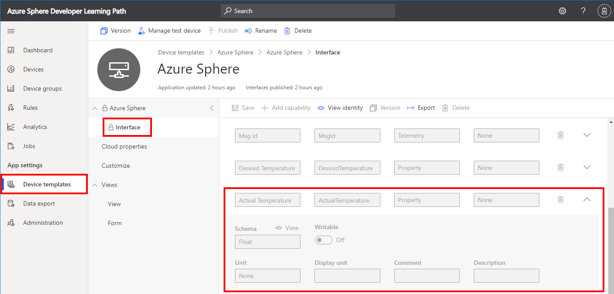
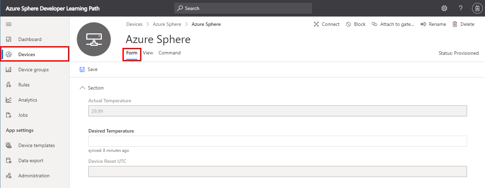
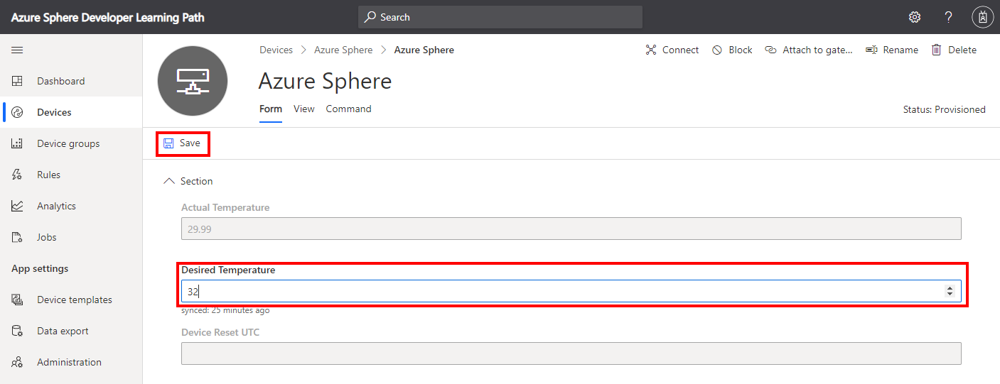

# Lab 3: Set the room virtual thermostat with Azure IoT Device Twins

---

|Author|[Dave Glover](https://developer.microsoft.com/en-us/advocates/dave-glover?WT.mc_id=julyot-azd-dglover), Microsoft Cloud Developer Advocate, [@dglover](https://twitter.com/dglover) |
|:----|:---|
|Date| March 2020|

---

## Azure Sphere Learning Path

Each module assumes you have completed the previous module.

[Home](../../../README.md)

* Lab 0: [Lab Set Up](../Lab_0_Introduction_and_Lab_Set_Up/README.md)
* Lab 1: [Introduction to Azure Sphere development](../Lab_1_Visual_Studio_and_Azure_Sphere/README.md)
* Lab 2: [Connect a room environment monitor to Azure IoT](../Lab_2_Send_Telemetry_to_Azure_IoT_Central/README.md)
* Lab 3: [Set the room virtual thermostat with Azure IoT Device Twins](../Lab_3_Control_Device_with_Device_Twins/README.md)
* Lab 4: [Remote reboot your Azure Sphere with Azure IoT Direct Methods](../Lab_4_Control_Device_with_Direct_Methods/README.md)
* Lab 5: [Integrate FreeRTOS Real-time room sensors with Azure IoT](../Lab_5_FreeRTOS_and_Inter-Core_Messaging/README.md)
* Lab 6: [Integrate Azure RTOS Real-time room sensors with Azure IoT](../Lab_6_AzureRTOS_and_Inter-Core_Messaging/README.md)
* Lab 7: [Connect and control your room environment monitor with Azure IoT](../Lab_7_Azure_IoT_Central_RTOS_Integration/README.md)
<!-- * Lab 8: [Over-the-air (OTA) Deployment](/docs/Lab_8_Over-the-air-deployment/README.md) -->

---

## What you will learn

You will learn how to control an [Azure Sphere](https://azure.microsoft.com/services/azure-sphere/?WT.mc_id=julyot-azd-dglover) application using [Azure IoT Central](https://azure.microsoft.com/services/iot-central/?WT.mc_id=julyot-azd-dglover) Properties.

---

## Prerequisites

This lab assumes you have completed [Lab 2: Send Telemetry from an Azure Sphere to Azure IoT Central](../Lab_2_Send_Telemetry_to_Azure_IoT_Central/README.md). You will have created an Azure IoT Central application, connected Azure IoT Central to your Azure Sphere Tenant, and you have configured the **app_manifest.json** for Azure IoT Central.

---

## Introduction to the Learning Path Labs

There are a number of Learning Path libraries that support these labs. These Learning Path C functions are prefixed with **lp_**, typedefs and enums are prefixed with **LP_**. 

The Learning Path libraries are open source and contributions are welcome.

The Learning Path libraries are built from the [Azure Sphere Samples](https://github.com/Azure/azure-sphere-samples) and aim to demonstrate best practices.

The Learning Path libraries are **not** part of the official Azure Sphere libraries or samples.

---

## Tutorial Overview

There are three options for Azure IoT cloud to device communications: 

1. [Direct Methods](https://docs.microsoft.com/en-us/azure/iot-hub/iot-hub-devguide-direct-methods?WT.mc_id=julyot-azd-dglover) for communications that require immediate confirmation of the result. Direct methods are often used for interactive control of devices, such as turning on a fan.

2. [Device Twins](https://docs.microsoft.com/en-us/azure/iot-hub/iot-hub-devguide-device-twins?WT.mc_id=julyot-azd-dglover) are for long-running commands intended to put the device into a certain desired state. For example, set the sample rate for a sensor to every 30 minutes.

3. [Cloud-to-device](https://docs.microsoft.com/en-us/azure/iot-hub/iot-hub-devguide-messages-c2d?WT.mc_id=julyot-azd-dglover) messages are for one-way notifications to the device app.

This lab will cover Azure IoT Device Twins.

---

## Key Concepts

In Lab 1, **Peripherals** and **Event Timers** were introduced to simplify and describe GPIO pins and Event Timers and their interactions.

In this lab, **DeviceTwinBindings** are introduced to simplify the implementation of Azure IoT [Device Twins](https://docs.microsoft.com/en-us/azure/iot-hub/iot-hub-devguide-device-twins?WT.mc_id=julyot-azd-dglover).

---

## Azure IoT Device Twins

Device twins are JSON documents that store device information, including metadata, configurations, and conditions. Azure IoT Hub keeps a device twin for each device that you connect to IoT Hub. Azure IoT Central is an application built on Azure IoT Hub, and it uses device twins to manage properties.

You can use device twins as follows:

1. Cloud to device updates.

	A user sets an Azure IoT Central device property. For example, to set the temperature of the room. IoT Central sends a desired property device twin message to the device. The device implements the desired property, and then the device responds with a reported property device twin message. Azure IoT Hub stores the reported property. 
2. Device to cloud updates.

	A device can send a reported property device twin message to Azure. For example, a device could report its firmware level on startup.  Azure IoT Hub stores the reported property. 

3. Querying reported properties.

	With device twins reported state stored in Azure, it is possible to query the stored device twin properties cloud side. For example, list all devices with a firmware version less than 2.0, as these devices require an update. Or, list all rooms with a temperature setting higher than 25 degrees Celsius.

The following outlines how Azure IoT Central uses Device Twins to set properties on a device: 

1. A user sets the value of a property in Azure IoT Central. For example, set the desired room temperature.
2. Azure IoT Hub sends a desired property message to the device. 
3. The device implements the desired property; in this case, turn on the heater or cool to bring the room to the desired temperature.
4. The device sends a reported property message back to Azure IoT. In this example, the device would report the new desired temperate.
5. Azure IoT Central queries and displays the devices reported property data. 


For more information, refer to the [Understand and use device twins in IoT Hub](https://docs.microsoft.com/en-us/azure/iot-hub/iot-hub-devguide-device-twins?WT.mc_id=julyot-azd-dglover) article.

---

## Device Twin Bindings

Azure IoT Central properties are implemented on Azure IoT Hub device twins. Device Twin Bindings map a device twin with a device property and a handler function that implements the action.

### Cloud to Device Updates

The following example declares a variable named **desiredTemperature** of type **LP_DEVICE_TWIN_BINDING**. This variable maps the Azure IoT Central *DesiredTemperature* property with a handler function named **DeviceTwinSetTemperatureHandler**.

```c
static LP_DEVICE_TWIN_BINDING desiredTemperature = { 
	.twinProperty = "DesiredTemperature", 
	.twinType = LP_TYPE_FLOAT, 
	.handler = DeviceTwinSetTemperatureHandler 
};
```

The following is the implementation of the handler function **DeviceTwinSetTemperatureHandler**. The handler function is called when the device receives a **DesiredTemperature** desired property message from Azure IoT Hub.

```c
/// <summary>
/// Device Twin Handler to set the desired temperature value
/// </summary>
static void DeviceTwinSetTemperatureHandler(LP_DEVICE_TWIN_BINDING* deviceTwinBinding)
{
	if (deviceTwinBinding->twinType == LP_TYPE_FLOAT)
	{
		desired_temperature = *(float*)deviceTwinBinding->twinState;
		SetTemperatureStatusColour(last_temperature);
	}
}
```

### Device to Cloud Updates

The following example declares an *actualTemperature* device twin property of type float. There is no handler function registered as this is a one-way device to cloud binding.

```c
static LP_DEVICE_TWIN_BINDING actualTemperature = {
		.twinProperty = "ActualTemperature",
		.twinType = LP_TYPE_FLOAT 
};
```

The ActualTemperature reported property message is sent to IoT Central by calling the DeviceTwinReportState function. You must pass a property of the correct type.

```c
lp_deviceTwinReportState(&actualTemperature, &last_temperature); // TwinType = LP_TYPE_FLOAT
```

---

## Azure IoT Central device properties

Azure IoT Central device properties are defined in Device templates.  

1. From Azure IoT Central, navigate to **Device template**, and select the **Azure Sphere** template.
2. Click on **Interface** to list the interface capabilities.
3. Scroll down and expand the **Actual Temperature** capability.
4. Review the definition of **Actual Temperature**. The capability type is **Property**, the Schema type is **Float**, and the property is **Writeable**. Writeable means this property is enabled for Cloud to Device updates.



---

## Working with Device Twins

Device twin bindings must be added to the **deviceTwinBindingSet**. When a device twin message is received from Azure, this set is checked for a matching *twinProperty* name. When a match is found, the corresponding handler function is called.

```c
LP_DEVICE_TWIN_BINDING* deviceTwinBindingSet[] = { &desiredTemperature, &actualTemperature };
```

### Opening

Sets are initialized in the **InitPeripheralsAndHandlers** function found in **main.c**.

```c
lp_openDeviceTwinSet(deviceTwinBindingSet, NELEMS(deviceTwinBindingSet));
```

### Dispatching

When a Device Twin message is received, the deviceTwinBindingSet is checked for a matching **twinProperty** name. When a match is found, the corresponding handler function is called.

### Closing

Sets are closed in the **ClosePeripheralsAndHandlers** function found in **main.c**.

```c
lp_closeDeviceTwinSet();
```

---

## Open Lab 3

### Step 1: Start Visual Studio 2019


### Step 2: Open the lab project

1. Click **Open a local folder**.
2. Open the Azure-Sphere lab folder.
3. Open the **Lab_3_Device_Twins** folder.
4. Click **Select Folder** button to open the project.

    <!--  -->

### Step 3: Set your developer board configuration

These labs support developer boards from AVNET and Seeed Studio. You need to set the configuration that matches your developer board.

The default developer board configuration is for the AVENT Azure Sphere Starter Kit. If you have this board, there is no additional configuration required.

1. Open CMakeList.txt
2. Add a # at the beginning of the set AVNET line to disable it.
3. Uncomment the **set** command that corresponds to your Azure Sphere developer board.
4. Save the file. This will auto-generate the CMake cache.

    

### Step 4: Configure the Azure IoT Central Connection Information

1. Open the **app_manifest.json** file.
2. You will need to redo the settings for the **app_manifest.json** file. Either copy from **Notepad** if you still have it open or copy from the **app_manifest.json** file you created in lab 2.

    

3. Paste the contents of the clipboard into **app_manifest.json** and save the file.

---

### Step 5: Visual Studio Deployment Settings

Before building the application with Visual Studio, ensure ARM-Debug and GDB Debugger (HLCore) options are selected.


---

### Step 6: Build, Deploy and start Debugging

To start the build, deploy, and debug process, either click the Visual Studio **Start Selected Item** icon or press <kbd>**F5**</kbd>. To Build and deploy without attaching the debugger, press <kbd>**Ctrl+F5**</kbd>.


---

## Expected Device Behaviour

### Avnet Azure Sphere MT3620 Starter Kit


1. The RGB LED5 will start to blink. In the next section, you will be setting the desired temperature which will determine the RGB LED colour.
2. LED4 will turn yellow when connected to Azure.
3. LED3 will blink when telemetry is sent to IoT Central
4. Press **Button A** or **Button B** on the device to change the blink rate of LED5 and to update the **Actual Temperature** Device twin property in IoT Central.

### Seeed Studio Azure Sphere MT3620 Development Kit


1. The RGB LED 1 will start to blink. In the next section, you will be setting the desired temperature which will determine the RGB LED colour.
2. The network LED will turn red when connected to Azure.
3. LED 4 will blink blue when telemetry is sent to IoT Central
4. Press **Button A** or **Button B** on the device to change the blink rate of RGB LED 1 and to update the **Actual Temperature** Device twin property in IoT Central.

### Seeed Studio MT3620 Mini Dev Board


1. The green LED closest to the USB connector will start to blink
2. Given this device has no builtin buttons then virtual **Button A** and **Button B** presses will be generated every 5 seconds. The blink rate will change and the **Actual Temperature** Device twin property in IoT Central will be updated.

---

## Display the actual temperature property

1. Switch to Azure IoT Central in your browser.
2. Select the **Devices**, then the **Azure Sphere** template, then your device.
3. Select the **Form** tab.
4. Azure Sphere devices with builtin buttons, press **Button A** or **Button B** to update the **Actual Temperature** property in IoT Central.

	>Note, IoT Central does not update immediately, it might take a minute or two for the Actual Temperature property to change.

	Virtual button press events are generated for Azure Sphere devices that do not have builtin buttons. 



## Set the desired temperature

Setting the desired temperature is like setting a thermostat in a room. A desired temperature device twin property message is sent to the Azure Sphere. 

When the temperature sensor is read on the Azure Sphere it is compared to the desired temperature. 

* If the temperature is greater than the desired temperature the blinking LED will turn blue to indicate the cooler needs be turned on.
* If the temperature is less than the desired temperature then the blinking LED will turn red to indicate the heater needs to be turned on.
* If the temperature is the same as the desired temperature then the blinking LED turns green to indicate no action required.

> The AVNET Azure Sphere Starter Kit has a built-in temperature sensor. For other boards, a random temperature near 25 degrees celsius is generated.

To set the desired temperature:

1. Update the **Desired Temperature** value.
2. Save the Property.
	This will send the desired temperature property to the Azure Sphere. The blinking LED colour may change depending on the desired temperature chosen.



---

## Close Visual Studio

Now close **Close Visual Studio**.

---

## Finished 完了 fertig finito समाप्त terminado

Congratulations you have finished lab 3.


---

**[NEXT](../Lab_4_Control_Device_with_Direct_Methods/README.md)**

---
