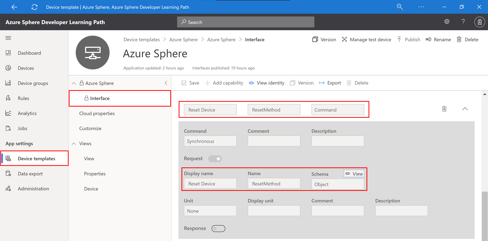
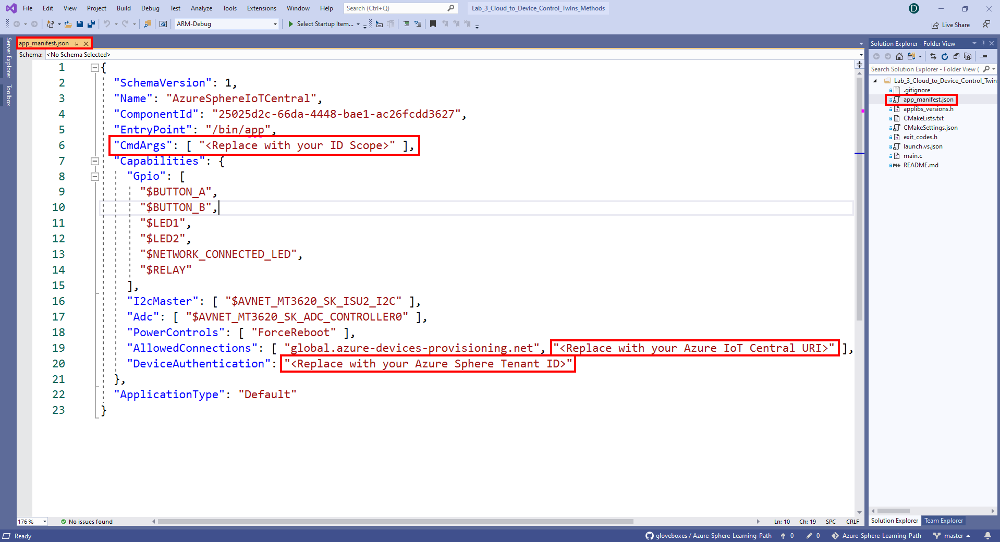

# Lab 4: Remote reboot your Azure Sphere with Azure IoT Direct Methods

---

|Author|[Dave Glover](https://developer.microsoft.com/en-us/advocates/dave-glover?WT.mc_id=julyot-azd-dglover), Microsoft Cloud Developer Advocate, [@dglover](https://twitter.com/dglover) |
|:----|:---|
|Date| March 2020|

---

## Azure Sphere Learning Path

Each module assumes you have completed the previous module.

[Home](../../../README.md)

* Lab 0: [Lab Set Up](../Lab_0_Introduction_and_Lab_Set_Up/README.md)
* Lab 1: [Introduction to Azure Sphere development](../Lab_1_Visual_Studio_and_Azure_Sphere/README.md)
* Lab 2: [Connect a room environment monitor to Azure IoT](../Lab_2_Send_Telemetry_to_Azure_IoT_Central/README.md)
* Lab 3: [Set the room virtual thermostat with Azure IoT Device Twins](../Lab_3_Control_Device_with_Device_Twins/README.md)
* Lab 4: [Remote reboot your Azure Sphere with Azure IoT Direct Methods](../Lab_4_Control_Device_with_Direct_Methods/README.md)
* Lab 5: [Integrate FreeRTOS Real-time room sensors with Azure IoT](../Lab_5_FreeRTOS_and_Inter-Core_Messaging/README.md)
* Lab 6: [Integrate Azure RTOS Real-time room sensors with Azure IoT](../Lab_6_AzureRTOS_and_Inter-Core_Messaging/README.md)
* Lab 7: [Connect and control your room environment monitor with Azure IoT](../Lab_7_Azure_IoT_Central_RTOS_Integration/README.md)
<!-- * Lab 8: [Over-the-air (OTA) Deployment](/zdocs/Lab_8_Over-the-air-deployment/README.md) -->

---

## What you will learn

You will learn how to control an [Azure Sphere](https://azure.microsoft.com/services/azure-sphere/?WT.mc_id=julyot-azd-dglover) application using [Azure IoT Central](https://azure.microsoft.com/services/iot-central/?WT.mc_id=julyot-azd-dglover) Properties and Commands.

---

## Prerequisites

This lab assumes you have completed [Lab 2: Send Telemetry from an Azure Sphere to Azure IoT Central](../Lab_2_Send_Telemetry_to_Azure_IoT_Central/README.md). You will have created an Azure IoT Central application, connected Azure IoT Central to your Azure Sphere Tenant, and you have configured the **app_manifest.json** for Azure IoT Central.

---

## Tutorial Overview

There are three options for Azure IoT cloud to device communications: 

1. [Direct Methods](https://docs.microsoft.com/en-us/azure/iot-hub/iot-hub-devguide-direct-methods?WT.mc_id=julyot-azd-dglover) for communications that require immediate confirmation of the result. Direct methods are often used for interactive control of devices, such as turning on a fan.

2. [Device Twins](https://docs.microsoft.com/en-us/azure/iot-hub/iot-hub-devguide-device-twins?WT.mc_id=julyot-azd-dglover) are for long-running commands intended to put the device into a certain desired state. For example, set the sample rate for a sensor to every 30 minutes.

3. [Cloud-to-device](https://docs.microsoft.com/en-us/azure/iot-hub/iot-hub-devguide-messages-c2d?WT.mc_id=julyot-azd-dglover) messages are for one-way notifications to the device app.

This lab will cover Azure IoT Direct Methods.

---

## Key Concepts

In Lab 1, **Peripherals** and **Event Timers** were introduced to simplify and describe GPIO pins and Event Timers and their interactions.

In this lab, **DirectMethodBindings** are introduced to simplify the implementation of Azure IoT [Direct Methods](https://docs.microsoft.com/en-us/azure/iot-hub/iot-hub-devguide-direct-methods?WT.mc_id=julyot-azd-dglover) on the device.

---


## Azure IoT Direct Methods

The following outlines how Azure IoT Central Commands uses Azure IoT Hub Direct Methods for cloud to device control.

1. A user invokes an Azure IoT Central Command. Azure IoT Hub sends a Direct Method message to the device. For example, reset the device. This message includes the method name and an optional payload. 
2. The device receives the direct method message and calls the associated handler function 
3. The device implements the direct method; in this case, reset the device. 
4. The device responds with an HTTP status code, and optionally a response message. 


For more information, refer to the [Understand and invoke direct methods from IoT Hub](https://docs.microsoft.com/en-us/azure/iot-hub/iot-hub-devguide-direct-methods?WT.mc_id=julyot-azd-dglover) article.

---

## Direct Method Bindings

Direct Method Bindings map a direct method with a handler function that implements an action.

### Cloud to Device Commands

In main.c the variable named resetDevice of type DirectMethodBinding is declared. This variable maps the Azure IoT Central ResetMethod command property with a handler function named ResetDirectMethod.

```c
static LP_DIRECT_METHOD_BINDING resetDevice = { 
	.methodName = "ResetMethod", 
	.handler = ResetDirectMethodHandler 
};
```

---

## Azure IoT Central Commands

Azure IoT Central commands are defined in Device templates.

1. From Azure IoT Central, navigate to **Device template**, and select the **Azure Sphere** template.
2. Click on **Interface** to list the interface capabilities.
3. Scroll down and expand the **ResetMethod** capability.
4. Review the definition of **ResetMethod**. The capability type is **Command**.
5. The schema type is **Object**. Click on the **view** button to display the object definition. The Object definition describes the shape of the JSON payload sent with the command. In this example, the shape of the JSON payload will be the same as this example *{"reset_timer":5}*.



---

## Direct Method Handler Function

1. From Azure IoT Central, a user invokes the **Reset Azure Sphere** command. 

	A Direct Method named **ResetMethod**, along with a JSON payload, is sent to the device. The JSON payload *{"reset_timer":5}* specifies how many seconds to wait before resetting the device.

2. The ResetDirectMethod function handler is called.

	When the device receives a Direct Method message, the DirectMethodBindings Set is checked for a matching DirectMethodBinding *methodName* name. When a match is found, the associated DirectMethodBinding handler function is called.

3. The current UTC time is reported to Azure IoT using a Device Twin Binding property named **DeviceResetUTC**.

4. The Direct Method responds back with an HTTP status code and a response message

5. The device is reset.

6. Azure IoT Central queries and displays the Device Twin reported property **DeviceResetUTC**.


```c
/// <summary>
/// Start Device Power Restart Direct Method 'ResetMethod' {"reset_timer":5}
/// </summary>
static LP_DIRECT_METHOD_RESPONSE_CODE ResetDirectMethodHandler(JSON_Object* json, LP_DIRECT_METHOD_BINDING* directMethodBinding, char** responseMsg)
{
	const char propertyName[] = "reset_timer";
	const size_t responseLen = 60; // Allocate and initialize a response message buffer. The calling function is responsible for the freeing memory
	static struct timespec period;

	*responseMsg = (char*)malloc(responseLen);
	memset(*responseMsg, 0, responseLen);

	if (!json_object_has_value_of_type(json, propertyName, JSONNumber))
	{
		return LP_METHOD_FAILED;
	}
	int seconds = (int)json_object_get_number(json, propertyName);

	// leave enough time for the device twin deviceResetUtc to update before restarting the device
	if (seconds > 2 && seconds < 10)
	{
		// Report Device Reset UTC
		lp_deviceTwinReportState(&deviceResetUtc, lp_getCurrentUtc(msgBuffer, sizeof(msgBuffer))); // LP_TYPE_STRING

		// Create Direct Method Response
		snprintf(*responseMsg, responseLen, "%s called. Reset in %d seconds", directMethodBinding->methodName, seconds);

		// Set One Shot LP_TIMER
		period = (struct timespec){ .tv_sec = seconds, .tv_nsec = 0 };
		lp_setOneShotTimer(&resetDeviceOneShotTimer, &period);

		return LP_METHOD_SUCCEEDED;
	}
	else
	{
		snprintf(*responseMsg, responseLen, "%s called. Reset Failed. Seconds out of range: %d", directMethodBinding->methodName, seconds);
		return LP_METHOD_FAILED;
	}
}
```

---

## Working with Direct Method Binding

Direct method bindings must be added to the **directMethodBindingSet**. When a direct method message is received from Azure, this set is checked for a matching *methodName* name. When a match is found, the corresponding handler function is called.

```c
LP_DIRECT_METHOD_BINDING* directMethodBindingSet[] = { &resetDevice };
```

### Opening

Sets are initialized in the **InitPeripheralsAndHandlers** function found in **main.c**.

```c
lp_openDirectMethodSet(directMethodBindingSet, NELEMS(directMethodBindingSet));
```

### Dispatching

When a Direct Method message is received, the set is checked for a matching *methodName* name. When a match is found, the corresponding handler function is called.

### Closing

Sets are closed in the **ClosePeripheralsAndHandlers** function found in **main.c**.

```c
lp_closeDirectMethodSet();
```

---

## Open Lab 4

### Step 1: Start Visual Studio 2019


### Step 2: Open the lab project

1. Click **Open a local folder**.
2. Open the Azure-Sphere lab folder.
3. Open the **Lab_4_Direct_Methods** folder.
4. Click **Select Folder** button to open the project.

    <!--  -->

### Step 3: Set your developer board configuration

These labs support developer boards from AVNET and Seeed Studio. You need to set the configuration that matches your developer board.

The default developer board configuration is for the AVENT Azure Sphere Starter Kit. If you have this board, there is no additional configuration required.

1. Open CMakeList.txt
2. Add a # at the beginning of the set AVNET line to disable it.
3. Uncomment the **set** command that corresponds to your Azure Sphere developer board.
4. Save the file. This will auto-generate the CMake cache.

    

### Step 4: Configure the Azure IoT Central Connection Information

1. Open the **app_manifest.json** file.
2. You will need to redo the settings for the **app_manifest.json** file. Either copy from **Notepad** if you still have it open or copy from the **app_manifest.json** file you created in lab 2.

    

3. Paste the contents of the clipboard into **app_manifest.json** and save the file.

---

### Step 5: Visual Studio Deployment Settings

Before building the application with Visual Studio, ensure ARM-Debug and GDB Debugger (HLCore) options are selected.


---

### Step 6: Build, Deploy and start Debugging

To start the build, deploy, and debug process, either click the Visual Studio **Start Selected Item** icon or press <kbd>**F5**</kbd>. To Build and deploy without attaching the debugger, press <kbd>**Ctrl+F5**</kbd>.


---

## Expected Device Behaviour

### Avnet Azure Sphere MT3620 Starter Kit


1. LED3 will turn yellow when connected to Azure. 

### Seeed Studio Azure Sphere MT3620 Development Kit


1. The network LED will turn red when connected to Azure.

### Seeed Studio MT3620 Mini Dev Board


1. The green LED closest to the USB connector will turn on when connected to Azure

---

## Testing Azure IoT Central Commands

1. From Visual Studio, ensure the Azure Sphere is running the application and set a breakpoint in the **ResetDirectMethod** handler function.
2. Switch to Azure IoT Central in your web browser.
3. Select the Azure IoT Central **Commands** tab.
4. Set the **Reset Azure Sphere** time in seconds, then click **Run**.
5. Observer the device rebooting. The LEDs will turn off for a few seconds.
    
6. Switch back to Visual Studio. The application execution should have stopped where you set the breakpoint. Step over code <kbd>F10</kbd>, step into code <kbd>F11</kbd>, and continue code execution <kbd>F5</kbd>.
7. Switch back to Azure IoT Central, and click the **Command History** button to view the result of the command.
	> Note, you may see a timed out message in the history depending on how long it took you to step through the code in Visual Studio.

---

## Close Visual Studio

Now close **Close Visual Studio**.

---

## Finished 完了 fertig finito समाप्त terminado

Congratulations you have finished lab 3.


---

**[NEXT](../Lab_5_FreeRTOS_and_Inter-Core_Messaging/README.md)**

---
