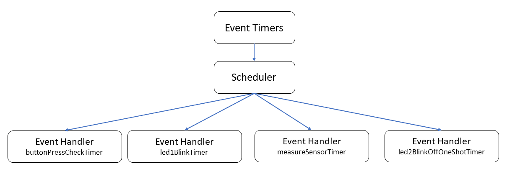
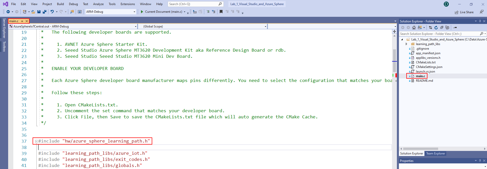
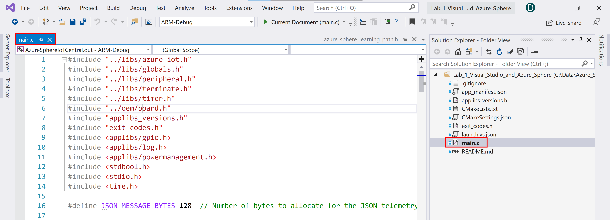
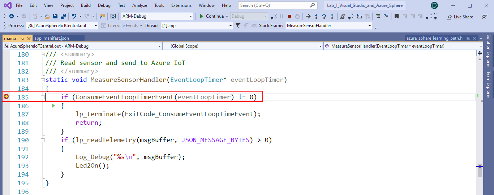

# Lab 1: Build your first Azure Sphere Application with Visual Studio

<!--  -->

---

|Author|[Dave Glover](https://developer.microsoft.com/en-us/advocates/dave-glover?WT.mc_id=github-blog-dglover), Microsoft Cloud Developer Advocate, [@dglover](https://twitter.com/dglover) |
|:----|:---|
|Source Code | https://github.com/gloveboxes/Azure-Sphere-Learning-Path.git |
|Date| March 2020 |

---

## Azure Sphere Learning Path

Each module assumes you have completed the previous module.

[Home](https://github.com/gloveboxes/Azure-Sphere-Learning-Path/blob/master/README.md)

* Lab 0: [Introduction Azure Sphere and Lab Set Up](/zdocs/Lab_0_Introduction_and_Lab_Set_Up/README.md)
* Lab 1: [Build your first Azure Sphere Application with Visual Studio](/zdocs/Lab_1_Visual_Studio_and_Azure_Sphere/README.md)
* Lab 2: [Send Telemetry from an Azure Sphere to Azure IoT Central](/zdocs/Lab_2_Send_Telemetry_to_Azure_IoT_Central/README.md)
* Lab 3: [Control an Azure Sphere with Device Twins and Direct Methods](/zdocs/Lab_3_Control_Device_with_Device_Twins_and_Direct_Methods/README.md)
* Lab 4: [Integrating FreeRTOS with Azure Sphere Inter-Core Messaging](/zdocs/Lab_4_FreeRTOS_and_Inter-Core_Messaging/README.md)
* Lab 5: [Integrating FreeRTOS with Azure IoT Central](/zdocs/Lab_5_FreeRTOS_and_Azure_IoT_Central/README.md)
* Lab 6: [Mass Device Deployment with Azure IoT Central](/zdocs/Lab_6_Mass_Device_Deployment/README.md)

---

## What you will learn

In this lab you will learn how to secure, build, deploy, and debug your first High-Level (HL) Azure Sphere application onto the Azure Sphere A7 Core.

---

## Prerequisites

This lab assumes you have completed **Lab 0: Lab set up, installation and configuration**

---

## Tutorial Overview

1. Understand Peripheral and Timer concepts.
2. Open the lab project with Visual Studio
3. Review the High-Level (A7) Core application security requirements.
4. Understand device manufacture pin mappings.
5. Application deployment and debugging

---

## Key Concepts

Lab 1 introduces two data structures used to greatly simplify and effectively describe in code how [GPIO](https://en.wikipedia.org/wiki/General-purpose_input/output) and Event Timers work.

### Input and Output Peripherals

In **main.c** there are a number of variables declared of type **Peripheral** including LEDs, buttons, and a relay. Variables of type **Peripheral** declare a generalized GPIO model for **input** and **output** single pin peripherals to support simple peripherals like LEDs, buttons, reed switches, relays and more.

This variable holds the GPIO pin number, the initial state of the pin when it is opened, whether the pin logic needs to be inverted when turning a pin on and off, and the C Function to be called to open the peripheral.

The following example declares an LED **output** peripheral.

```c
static Peripheral led1 = {
	.pin = LED1, // The GPIO pin number
	.direction = OUTPUT, // for OUTPUT
	.initialState = GPIO_Value_Low, // Set the initial state on the pin when opened
	.invertPin = true, // Should the switching logic be reverse for on/off, high/low
	.initialise = OpenPeripheral, // The name of C function to be called to open the Pin.
	.name = "led1" // An arbitrary name for the peripheral.
};
```

The following example declares a button **INPUT** peripheral.

```c
static Peripheral buttonA = {
	.pin = BUTTON_A,
	.direction = INPUT, 	// for INPUT
	.initialise = OpenPeripheral,
	.name = "buttonA"
};
```

### Event Timers

Events Timers generate periodic events. For example, you may want to blink an LED every second, or perhaps read data from a sensor every 10 seconds. This is also known as [event-driven programming](https://en.wikipedia.org/wiki/Event-driven_programming).

Timers generate events, and the events are bound to handler functions. Event-driven programming helps to simplify application design. For example, every 10 seconds read the temperate, every 20 seconds check the network connection, every 1 second blink an LED so the user knows the device is active, every 100 milliseconds read the state of a button.



Event timers are used throughout these labs, and in lots of projects, so there is a generalized model to simplify working with timers.

There are two types of timers, **periodic timers**, and **one shot timers**.

#### Periodic Timers

In **main.c** there is variable named **measureSensorTimer** of type **Timer**. 

This event timer is initialized with a period of 10 seconds **{ 10, 0 }**, when the timer fires, the handler function **MeasureSensorHandler** is called.

> There are two values used to initialize the **.period** variable, the first is the number of seconds, followed by the number of nanoseconds. If you wanted the timer to fire events every half a second (500 milliseconds), you would set the .period to be { 0, 500000000 }.

<!-- static Timer measureSensorTimer = {
	.period = { 10, 0 },	// Fire the timer event every 10 seconds + zero nanoseconds.
	.name = "measureSensorTimer",	// An arbitrary name for the timer, used for error handling
	.timerEventHandler = MeasureSensorHandler	// The address of the C handler function to be called when the timer fires.
}; -->

```c
static Timer measureSensorTimer = { .period = { 10, 0 }, .name = "measureSensorTimer", .handler = MeasureSensorHandler };
```

The following is the implementation of the **MeasureSensorHandler** handler function. This functions reads telemetry, then  calls Led2On() to turn on led2.

```c
/// <summary>
/// Read sensor and send to Azure IoT
/// </summary>
static void MeasureSensorHandler(EventLoopTimer* eventLoopTimer) {
	if (ConsumeEventLoopTimerEvent(eventLoopTimer) != 0) {
		Terminate();
		return;
	}
	if (ReadTelemetry(msgBuffer, JSON_MESSAGE_BYTES) > 0) {
		Log_Debug("%s\n", msgBuffer);
		Led2On();
	}
}
```

#### One Shot Timers

The following code uses a one shot timer to blink an LED once when a button is pushed. The LED is turned on, then a one shot timer is set, when the period expires, a handler function is called to turn off the LED.

The advantage of this event driven pattern is the device can continue to service other events such as checking if a user has pressed a button.

In **main.c** there is variable named **led2BlinkOffOneShotTimer** of type **Timer**. This timer is initialized with a period of { 0, 0 }. Timers initialized with a period of 0 seconds are one shot timers. The timer is enabled by a call to **SetOneShotTimer**. When the one shot timer period is set and expires the handler function **Led2OffHandler** is called.

```c
static Timer led2BlinkOffOneShotTimer = { .period = { 0, 0 }, .name = "led2BlinkOffOneShotTimer", .handler = Led2OffHandler };
```

In the **Led2On** function, led2 is turned on, then a one shot timer is set to turn off led2.

> The led2BlinkPeriod variable is set to 300,000,000 nanoseconds (300 milliseconds). This means led2 will be turned off 300 milliseconds after it was turned on.

```c
/// <summary>
/// Turn on LED2 and set a one shot timer to turn LED2 off
/// </summary>
static void Led2On(void) {
	Gpio_On(&led2);
	SetOneShotTimer(&led2BlinkOffOneShotTimer, &led2BlinkPeriod);
}
```

When the one shot timer period expires the **Led2OffHandler** handler function is called and LED2 is turned off.

```c
/// <summary>
/// One shot timer to turn LED2 off
/// </summary>
static void Led2OffHandler(EventLoopTimer* eventLoopTimer) {
	if (ConsumeEventLoopTimerEvent(eventLoopTimer) != 0) {
		Terminate();
		return;
	}
	Gpio_Off(&led2);
}
```

### Automatic Initialization of Peripherals and Timers

Peripherals and timers are added to **Sets**. Peripherals and timers referenced in a set will be automatically opened and closed.

```c
Peripheral* peripheralSet[] = { &buttonA, &buttonB, &led1, &led2, &networkConnectedLed };
Timer* timerSet[] = { &led1BlinkTimer, &led2BlinkOffOneShotTimer, &buttonPressCheckTimer, &networkConnectionStatusTimer, &measureSensorTimer };
```

These sets are referenced when calling **OpenPeripheralSet**, and **StartTimerSet** from the **InitPeripheralsAndHandlers** function. The sets are also referenced when closing the peripheral and timer sets in the **ClosePeripheralsAndHandlers** function.

```c
static int InitPeripheralsAndHandlers(void)
{
	InitializeDevKit();  // Avnet Starter kit

	OpenPeripheralSet(peripheralSet, NELEMS(peripheralSet));
	StartTimerSet(timerSet, NELEMS(timerSet));

	return 0;
}
```

### Easy to Extend

This model makes it easy to declare another peripheral or timer and add them to the **peripherals** or **timers** arrays. The following is an example of adding a GPIO output peripheral.

```c
static Peripheral fanControl = {
	.pin = FAN1, // The GPIO pin number
	.direction = OUTPUT, // for OUTPUT
	.initialState = GPIO_Value_Low,  // Set the initial state on the pin when opened
	.invertPin = true,  // Should the switching logic be reverse for on/off, high/low
	.initialise = OpenPeripheral,  // The name of C function to be called to open the Pin.
	.name = "FanControl"  // An arbitrary name for the senor.
};

```

Remember to add this new peripheral to the **peripherals** set so it will be automatically opened, initialized, and closed.

```c
Peripheral* peripherals[] = { &buttonA, &buttonB, &led1, &led2, &networkConnectedLed, &fanControl };
```

---

## Open Lab 1

### Step 1: Lab Set Up

Ensure you have followed all the instructions in the [lab set-up guide](../Lab_0_Introduction_and_Lab_Set_Up).

### Step 2: Start Visual Studio 2019


### Step 3: Open the lab project

1. Click **Open a local folder**
2. Open the Azure-Sphere lab folder
3. Open the **folder name** that corresponds to the **Azure Sphere board** you are using
4. Open the **Lab_1_Visual_Studio_and_Azure_Sphere** folder
5. Click **Select Folder** button to open the project


### Step 4: Verify the Project Opened Correctly

From the **Solution Explorer**, open the **main.c** file.


---

### Check CMake Cache Builds Correctly

The generation of the CMake cache runs automatically when you open a CMake project. But given this is the first lab to be opened it is a good idea to rerun the **CMake Cache Generator** to check that it is building correctly.

1. Right mouse click the **CMakeLists.txt** file and select **Generate Cache for AzureSphereIoTCentral**.

	

2. Check the **Output** window that the CMake generation was successful. There should be a message to say **CMake generation finished**.

	

	If the CMake Generation fails, then move the labs to a directory closer to the root directory on your local drive.

---

## Understanding Azure Sphere Security

Applications on Azure Sphere are locked down by default and you must grant capabilities to the application. This is key to Azure Sphere security and is also known as the [Principle of least privilege](https://en.wikipedia.org/wiki/Principle_of_least_privilege).

Application capabilities include what hardware can be accessed, what internet services can be called (including Azure IoT Central and the Azure Device Provisioning Service), and what inter-core communications are allowed.

### Open the Application Manifest File

From Visual Studio open the **app_manifest.json** file.


This application can only access the resources listed in the **Capabilities** section.

**Note**, the following example is for the Avnet Azure Sphere device. The resource names and capabilities will differ depending on which Azure Sphere device you are using.

```json
  "Capabilities": {
    "Gpio": [
      "$BUTTON_A",
      "$BUTTON_B",
      "$LED1",
      "$LED2",
      "$NETWORK_CONNECTED_LED",
      "$RELAY"
    ],
    "I2cMaster": [ "$AVNET_MT3620_SK_ISU2_I2C" ],
    "Adc": [ "$AVNET_MT3620_SK_ADC_CONTROLLER0" ],
    "PowerControls": [ "ForceReboot" ],
    "AllowedConnections": [ "global.azure-devices-provisioning.net" ],
    "DeviceAuthentication": "00000000-0000-0000-0000-000000000000",
    "AllowedApplicationConnections": [ "6583cf17-d321-4d72-8283-0b7c5b56442b" ]
  },
```

## Understand Pin Mappings

Each Azure Sphere manufacturer maps pins differently.  To understand how the pins are mapped for your developer board then follow these steps.

1. Ensure you have the **main.c** file open. Place the cursor on the line that reads **#include "../oem/board.h"**, then press <kbd>F12</kbd>. This will open the **board.h** header file.

	

	Review the pin mappings that are being used for the lab. These will vary depending on what developer kit you are using.

2. From the **board.h** file, place the cursor on the line that includes **azure_sphere_learning_path.h**, then press <kbd>F12</kbd>.

	

	```c
	/* Copyright (c) Microsoft Corporation. All rights reserved.
	Licensed under the MIT License. */

	// This file defines the mapping from the MT3620 reference development board (RDB) to the
	// 'sample hardware' abstraction used by the samples at https://github.com/Azure/azure-sphere-samples.
	// Some peripherals are on-board on the RDB, while other peripherals must be attached externally if needed.
	// https://docs.microsoft.com/en-us/azure-sphere/app-development/manage-hardware-dependencies
	// to enable apps to work across multiple hardware variants.

	// This file is autogenerated from ../../azure_sphere_learning_path.json.  Do not edit it directly.

	#pragma once
	#include "avnet_mt3620_sk.h"

	// Button A
	#define BUTTON_A AVNET_MT3620_SK_USER_BUTTON_A

	// Button B
	#define BUTTON_B AVNET_MT3620_SK_USER_BUTTON_B

	// LED 1
	#define LED1 AVNET_MT3620_SK_USER_LED_BLUE

	// LED 2
	#define LED2 AVNET_MT3620_SK_APP_STATUS_LED_YELLOW

	// AVNET: Network Connected
	#define NETWORK_CONNECTED_LED AVNET_MT3620_SK_WLAN_STATUS_LED_YELLOW

	// Click Relay
	#define RELAY AVNET_MT3620_SK_GPIO0
	```

3. Review the pin mappings set up for the Azure Sphere Learning Path.

4. Next, click on the **main.c tab** to bring **main.c** to the foreground.

	

> Azure Sphere hardware is available from multiple vendors, and each vendor may expose features of the underlying chip in different ways. Azure Sphere applications manage hardware dependencies by using hardware definition files. For more information review [Managing target hardware dependencies](https://docs.microsoft.com/en-us/azure-sphere/app-development/manage-hardware-dependencies).

---

## Deploy the Application to the Azure Sphere

1. Connect the Azure Sphere to your computer via USB
2. Ensure you have [claimed](https://docs.microsoft.com/en-au/azure-sphere/install/claim-device?WT.mc_id=github-blog-dglover), [connected](https://docs.microsoft.com/en-au/azure-sphere/install/configure-wifi?WT.mc_id=github-blog-dglover), and [developer enabled](https://docs.microsoft.com/en-au/azure-sphere/install/qs-blink-application?WT.mc_id=github-blog-dglover) your Azure Sphere.
3. Ensure you have enabled developer mode on the Azure Sphere
4. Select **GDB Debugger (HLCore)** from the **Select Startup** dropdown.
	
5. From Visual Studio, press <kbd>F5</kbd> to build, deploy, start, and attached the remote debugger to the Azure Sphere.

---

## View the Debugger Output

Open the **Output** window to view the output from **Log_Debug** statements in the code.

You can open the output window by using the Visual Studio <kbd>Ctrl+Alt+O</kbd> shortcut or click the **Output** tab found along the bottom/right of Visual Studio.


---

## Set a Debugger Breakpoint

Set a debugger breakpoint by clicking in the margin to the left of the line of code you want the debugger to stop at.

1. In the **main.c** file, scroll down until you find the C function named **MeasureSensorHandler**. 

2. Set a breakpoint in the margin of the line that reads **ConsumeEventLoopTimerEvent**.

	

3. When the next timer event fires, the debugger will stop at the line you set the breakpoint on.
4. You can inspect variable values, step over code <kbd>F10</kbd>, step into code <kbd>F11</kbd>, and continue code execution <kbd>F5</kbd>. 
5. For more information on debugging then read [First look at the Visual Studio Debugger](https://docs.microsoft.com/en-us/visualstudio/debugger/debugger-feature-tour?view=vs-2019&WT.mc_id=github-blog-dglover)

---

## Stop the Debugger

**Stop** the debugger by using the Visual Studio <kbd>Shift+F5</kbd> keyboard shortcut or click the **Stop Debugging** icon.



---

## Close Visual Studio

Now close **Close Visual Studio**.

---

## Finished 完了 fertig finito ख़त्म होना terminado

Congratulations, you secured, built, deployed and debugged your first Azure Sphere application.


---

**[NEXT](../Lab_2_Send_Telemetry_to_Azure_IoT_Central/README.md)**

---
