# Lab 2: Send Telemetry from an Azure Sphere to Azure IoT Central

<!--  -->

---

|Author|[Dave Glover](https://developer.microsoft.com/en-us/advocates/dave-glover?WT.mc_id=github-blog-dglover), Microsoft Cloud Developer Advocate, [@dglover](https://twitter.com/dglover) |
|:----|:---|
|Date| March 2020|

---

## Azure Sphere Learning Path

Each module assumes you have completed the previous module.

[Home](https://github.com/gloveboxes/Azure-Sphere-Learning-Path/blob/master/README.md)

* Lab 0: [Introduction Azure Sphere and Lab Set Up](/zdocs/Lab_0_Introduction_and_Lab_Set_Up/README.md)
* Lab 1: [Build your first Azure Sphere Application with Visual Studio](/zdocs/Lab_1_Visual_Studio_and_Azure_Sphere/README.md)
* Lab 2: [Send Telemetry from an Azure Sphere to Azure IoT Central](/zdocs/Lab_2_Send_Telemetry_to_Azure_IoT_Central/README.md)
* Lab 3: [Control an Azure Sphere with Device Twins and Direct Methods](/zdocs/Lab_3_Control_Device_with_Device_Twins_and_Direct_Methods/README.md)
* Lab 4: [Integrating FreeRTOS with Azure Sphere Inter-Core Messaging](/zdocs/Lab_4_FreeRTOS_and_Inter-Core_Messaging/README.md)
* Lab 5: [Integrating FreeRTOS with Azure IoT Central](/zdocs/Lab_5_FreeRTOS_and_Azure_IoT_Central/README.md)
* Lab 6: [Over-the-air (OTA) Deployment](/zdocs/Lab_6_Over-the-air-deployment/README.md)

---

## What you will learn

You will learn how to build a High-Level [Azure Sphere](https://azure.microsoft.com/services/azure-sphere/?WT.mc_id=github-blog-dglover) application that connects and sends telemetry to [Azure IoT Central](https://azure.microsoft.com/services/iot-central/?WT.mc_id=github-blog-dglover).

---

## Prerequisites

The lab assumes you understand the content from [Lab 1: Secure, Build, Deploy and Debug your first Azure Sphere High-Level Application with Visual Studio](../Lab_1_Visual_Studio_and_Azure_Sphere/README.md)

---

## Introduction to the Learning Path Labs

There are a number of Learning Path libraries that support these labs. These Learning Path C functions are prefixed with **lp_**, typedefs and enums are prefixed with **LP_**. 

The Learning Path libraries are open source and contributions are welcome.

The Learning Path libraries are built from the [Azure Sphere Samples](https://github.com/Azure/azure-sphere-samples) and aim to demonstrate best practices.

The Learning Path libraries are **not** part of the official Azure Sphere libraries or samples.

---

## Supported browsers for Azure IoT Central

We recommend that you use the most up-to-date browser that's compatible with your operating system. The following browsers are supported:

* Microsoft Edge (latest version). This means the **Chromium** version of the Microsoft Edge Browser
* Safari (latest version, Mac only)
* Chrome (latest version)
* Firefox (latest version)

[Supported browsers for Azure IoT Central](https://docs.microsoft.com/en-us/azure/iot-central/core/iot-central-supported-browsers)

## Tutorial Overview

1. How to create an Azure IoT Central Application from a template.

2. Enabling trust between your Azure Sphere Tenant and your Azure IoT Central Application for automatic device enrollment.

3. Whitelisting the Azure IoT Central Application URL endpoint.

4. Configuring the Azure Sphere Application to connect to Azure IoT Central.

---

## Key Concepts

### Azure IoT

Your Azure Sphere device can securely connect and communicate with cloud services. Azure Sphere includes built-in library support for both Azure IoT Hub and Azure IoT Central. This lab focuses on Azure IoT Central.

This project leverages the [Azure IoT Hub Device Provisioning Service (PDS)](https://docs.microsoft.com/en-us/azure-sphere/app-development/use-azure-iot?WT.mc_id=github-blog-dglover), which is included with Azure IoT Central. The Device Provisioning Service (DPS) enables zero-touch, just-in-time, large scale device provisioning.

### Azure IoT Central

[Azure IoT Central](https://azure.microsoft.com/en-in/services/iot-central/?WT.mc_id=github-blog-dglover) provides an easy way to connect, monitor, and manage your Internet of Things (IoT) assets at scale.

Take a moment to read [Your IoT journey: simplified and secure with Azure IoT Central and Azure Sphere](https://techcommunity.microsoft.com/t5/internet-of-things/your-iot-journey-simplified-and-secure-with-azure-iot-central/ba-p/1404247).


---

### Create a new IoT Central Application

1. So the lab instructions are still visible, right mouse click, and open this link "[Azure IoT Central](https://azure.microsoft.com/en-au/services/iot-central/?WT.mc_id=pycon-blog-dglover)" in a new window.

2. Click **Build a solution**.

3. Next, you will need to sign with your Microsoft Personal, or Work, or School account. If you do not have a Microsoft account, then you can create one for free using the **Create one!** link.

    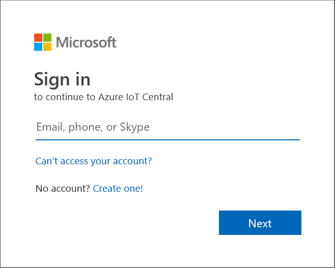

4. Expand the sidebar menu by clicking on the **burger Menu** icon.

    

5. Click **+ New application** to create a new Azure IoT Central application. 

6. Select **Custom app**

    

### Create a new application

1. Specify the **Application name**, the **URL**, select the **Free** pricing plan, and complete the registration form. 

    

2. Then click **Create**.

### Create a new device template

1. Click **Device templates**, then **+ New**.
    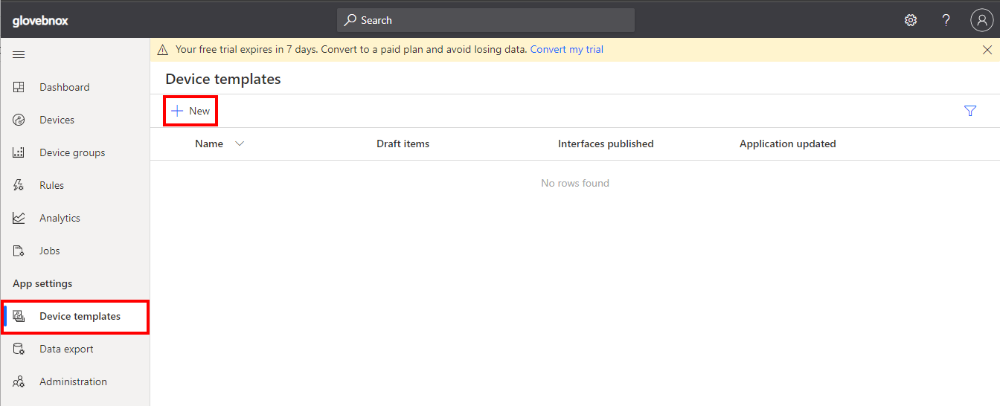

2. Click the **IoT device** template type

    

3. Create an **IoT Device** Template

    1. Select **IoT device**,
    2. Click **Next:Customise**,
    3. Name your template **Azure Sphere**,
    4. Click **Next: Review**,
    5. Click **Create**.

### Import a Capability Model

1. Click **Import capability model**
    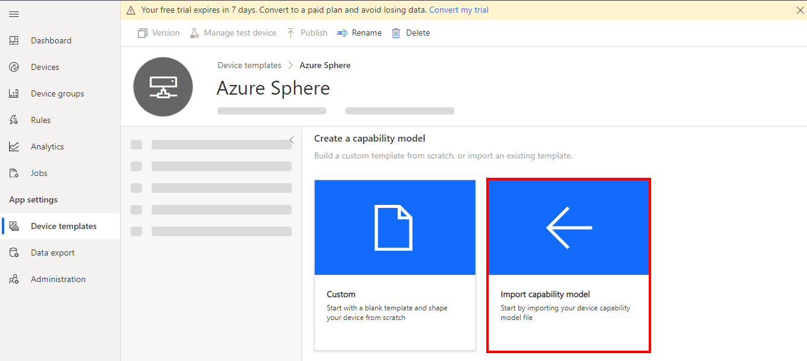
2. Navigate to the folder you cloned the Azure Sphere Developer Learning Path into.
3. Navigate to the **iot_central** folder.
4. Select **Azure_Sphere_Developer_Learning_Path.json** and open

### Create a device visualization view

1. Click **Views**
    
2. Select **Visualizing the device**
    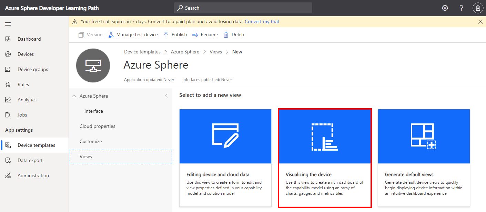
3. Select **Humidity**, **Pressure**, and **Temperature** telemetry items.
    
4. Click **Add Tile**

    <!--  -->
5. Select **Button A Alert**, and **Button B Alert** telemetry items.
    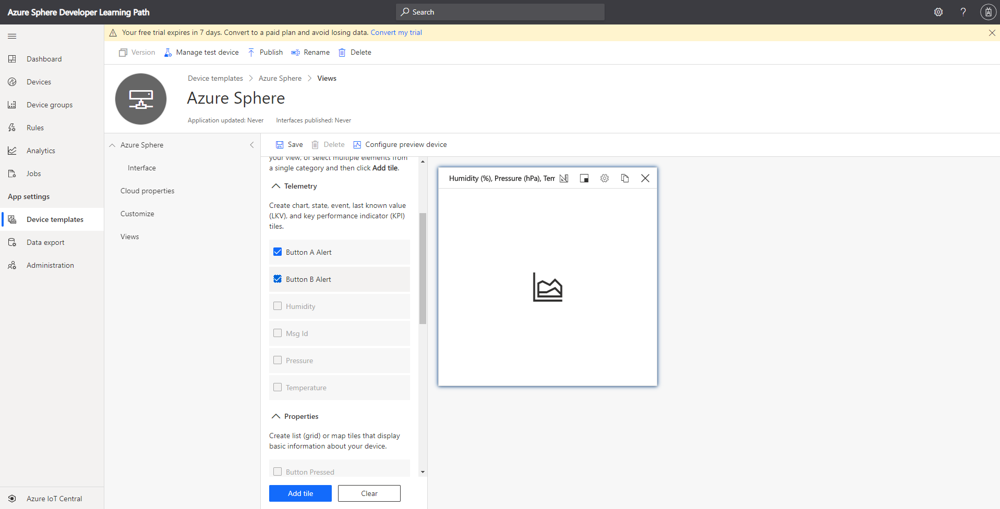
6. Click **Add Tile**
7. Scroll down to the **Properties** section and select all of the listed properties.

    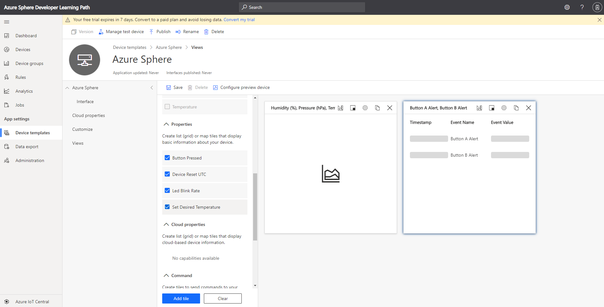
8. Click **Add Tile**
9. Drag the **Properties** tile so that it lines up with the existing tiles.

    
10. **Save** the view
    
    <br/>

### Create a properties form

1. Click **Views**, then click **Editing device and cloud data**.
    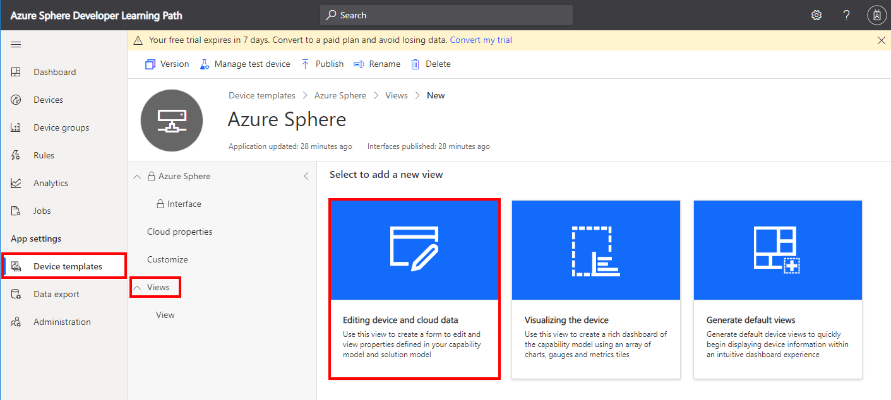
2. Expand the **Properties** section.
2. Select **Led Blink Rate** and **Set Desired Temperature**.

    
3. Click **Add Section**
4. **Save** the form
    

### Publish the device template

1. Click **Publish** to publish the template. Publishing the template makes it available for devices.
    <br/>
    

2. Confirm and click **Publish**
    <br/>

    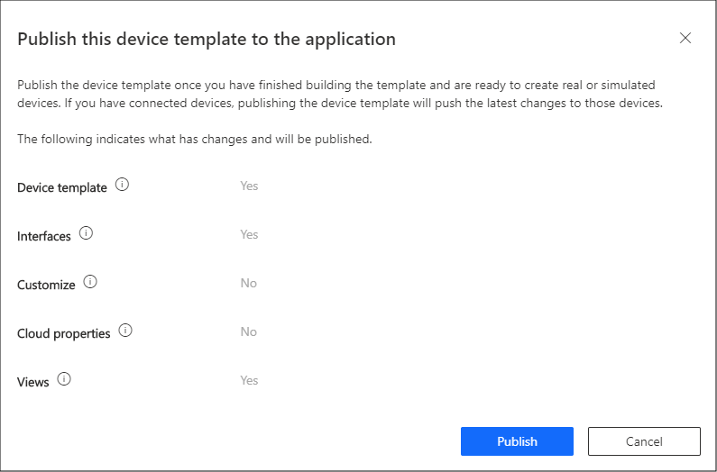

>See [Define a new IoT device type in your Azure IoT Central application](https://docs.microsoft.com/en-us/azure/iot-central/core/howto-set-up-template?WT.mc_id=github-blog-dglover) for information on creating your own device templates.

---

## Step 3: Link your Azure Sphere Tenant to IoT Central

We need set up a trust relationship between your Azure Sphere tenant and your IoT Central application.

After you have completed this step, any device that is claimed by your Azure Sphere tenant will be automatically enrolled when it first connects to your IoT Central application.

### Download the tenant authentication CA certificate

1. Open an **Azure Sphere Developer Command Prompt**
2. Be sure to make a note of the current directory, or change to the Azure Sphere Learning path directory. You will need the name of this directory in the next step. 
3. Download the Certificate Authority (CA) certificate for your Azure Sphere tenant:

    ```bash
    azsphere tenant download-CA-certificate --output CAcertificate.cer
    ```

    The output file must have the .cer extension.

### Upload the tenant CA certificate to Azure IoT Central and generate a verification code

1. In Azure IoT Central, go to Administration > Device Connection > Manage primary certificate.

2. Click the folder icon next to the Primary box and navigate to the directory where you downloaded the certificate. If you don't see the .cer file in the list, make sure that the view filter is set to All files (*). Select the certificate and then click the gear icon next to the Primary box.

3. The Primary Certificate dialog box appears. The Subject and Thumbprint fields contain information about the current Azure Sphere tenant and primary root certificate.

4. Click the Refresh icon to the right of the Verification Code box to generate a verification code. Copy the verification code to the clipboard.

    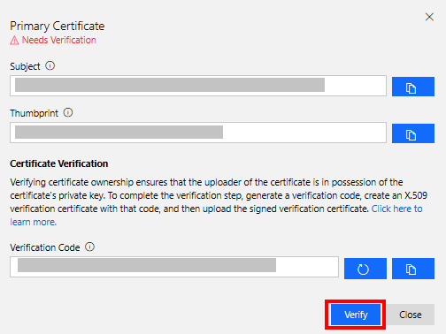

### Verify the tenant CA certificate

1. Return to the Azure Sphere Developer Command Prompt.

2. Download a validation certificate that proves that you own the tenant CA certificate. Replace code in the command with the verification code from the previous step.

    ```bash
    azsphere tenant download-validation-certificate --output ValidationCertification.cer --verificationcode <code>
    ```
3. The Azure Sphere Security Service signs the validation certificate with the verification code to prove that you own the CA.

### Use the validation certificate to verify the tenant identity

1. Return to Azure IoT Central and click Verify.
2. When prompted, navigate to the validation certificate that you downloaded in the previous step and select it. When the verification process is complete, the Primary Certificate dialog box displays the Verified message. Click Close to dismiss the box.

    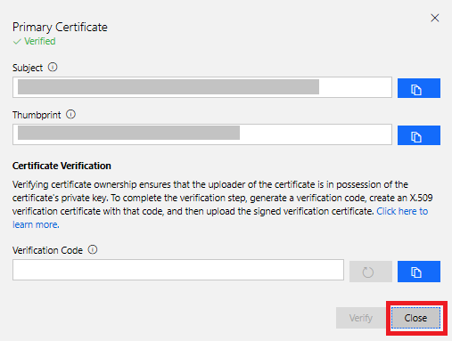

After you complete these steps, any device that is claimed into your Azure Sphere tenant will automatically be enrolled in your Azure IoT Central application when it first connects.

---

## Step 4: Whitelist the Azure IoT Central Application Endpoint URLs

Remember, applications on Azure Sphere are locked down by default, including hardware and network endpoints. You must whitelist the network endpoints of your Azure IoT Central application otherwise your Azure Sphere Application will not be able to connect to it.

Follow these steps:

1. Open the **Azure Sphere Developer Command Prompt**.
2. Navigate to the Samples -> AzureIoT -> Tools directory. You cloned the Azure Sphere samples repository in the first lab.
    * On Windows, navigate to the Samples\AzureIoT\Tools\win-x64 directory.
    * On Linux, navigate to the Samples\AzureIoT\Tools\linux-x64 directory. On Linux, you may need to explicitly set execution permissions for the ShowIoTCentralConfig tool. From a terminal, run `chmod +x ShowIoTCentralConfig` to add execution permissions for the tool.

3. When you run the **ShowIoTCentralConfig** tool, you will be prompted for input data. The following table outlines what information you will be prompted for and where to obtain the required data.

    | Input data | From |
    |------------|----------|
    | **Are you using a legacy (2018) IoT Central application (Y/N)** | Respond **N** |
    | **IoT&nbsp;Central&nbsp;App&nbsp;URL** |  This can be found in your browser address bar. For Example https://myiotcentralapp.azureiotcentral.com/ |
    | **API token** | This can be generated from your IoT Central application. In the Azure IoT Central application select **Administration**, select **API Tokens**, select **Generate Token**, provide a name for the token (for example, "AzureSphereSample"), select **Administrator** as the role, and click **Generate**. Copy the token to the clipboard. The token starts with **SharedAccessSignature**. |
    | **ID Scope** | In the Azure IoT Central application, select **Administration** > **Device Connection** and then copy the **ID Scope** |
4. Run the **ShowIoTCentralConfig** tool.
    Now follow the prompts that the tool provides, and copy the information from the output into the app_manifest.json file in Visual Studio.

    > **Note**: Your organization might require consent for the ShowIoTCentralConfig tool to access your Azure IoT Central data in the same way that the Azure API requires such consent. In some organizations, [enterprise application permissions](https://docs.microsoft.com/azure-sphere/install/admin-consent) must be granted by an IT administrator.
5. Review the output from the **ShowIoTCentralConfig** tool. It will look similar to the following text.

    ```text
    Find and modify the CmdArgs, AllowedConnections and DeviceAuthentication lines in your app_manifest.json so each includes the content from the below:
    "CmdArgs": [ "0ne000BDC00" ],
    "Capabilities": {
        "AllowedConnections": [ "global.azure-devices-provisioning.net", "iotc-9999bc-3305-99ba-885e-6573fc4cf701.azure-devices.net", "iotc-789999fa-8306-4994-b70a-399c46501044.azure-devices.net", "iotc-7a099966-a8c1-4f33-b803-bf29998713787.azure-devices.net", "iotc-97299997-05ab-4988-8142-e299995acdb7.azure-devices.net", "iotc-d099995-7fec-460c-b717-e99999bf4551.azure-devices.net", "iotc-789999dd-3bf5-49d7-9e12-f6999991df8c.azure-devices.net", "iotc-29999917-7344-49e4-9344-5e0cc9999d9b.azure-devices.net", "iotc-99999e59-df2a-41d8-bacd-ebb9999143ab.azure-devices.net", "iotc-c0a9999b-d256-4aaf-aa06-e90e999902b3.azure-devices.net", "iotc-f9199991-ceb1-4f38-9f1c-13199992570e.azure-devices.net" ],
        "DeviceAuthentication": "--- YOUR AZURE SPHERE TENANT ID---",
    }
    ```

6. **Copy** the output from the ShowIoTCentralConfig tool to **_Notepad_** as you will need this information soon.

---

## Step 5: Get the Azure Sphere Tenant ID

We need the ID of the Azure Sphere Tenant that is now trusted by Azure IoT Central.

1. From the **Azure Sphere Developer Command Prompt**, run **```azsphere tenant show-selected```**.
    * The output of this command will look similar to the following.
        ```text
        Default Azure Sphere tenant ID is 'yourSphereTenant' (99999999-e021-43ce-9999-fa9999499994).
        ```
    * The **Tenant ID** is the numeric value inside the parentheses.
2. **Copy the Tenant ID to _Notepad_** as you will need it soon.

---

## Azure IoT Central Device Templates

A device template is a blueprint that defines the characteristics and behaviors of a type of device that connects to an Azure IoT Central application.

For more information on device templates, review the [Define a new IoT device type in your Azure IoT Central application](https://docs.microsoft.com/en-us/azure/iot-central/core/howto-set-up-template?WT.mc_id=github-blog-dglover) article. 

1. From Azure IoT Central, navigate to **Device templates**, and select the **Azure Sphere** template.
2. Click on **Interfaces** to list the interface capabilities.
3. Explore the IoT Central device template interfaces, properties, and views.


---

## Azure IoT Central Events

Azure IoT Central can be configured to treat some telemetry as events. You would typically use these for alerts or notifications. For example, an emergency button was pressed.

### Step 1: Defining Azure IoT Central Interface Events

From Azure IoT Central, click **Device templates**, select the **Azure Sphere** template, and explore the Interface capabilities for ButtonA and ButtonB. Both of these capabilities are configured as **Events**.


### Step 2: Generating Azure IoT Central Events

Review the handler function **ButtonPressCheckHandler** below. The following code sends the Button Pressed events to Azure IoT Central.

```c
// Send ButtonA Pressed Event
if (snprintf(msgBuffer, JSON_MESSAGE_BYTES, cstrJsonEvent, cstrEvtButtonA) > 0) {
	SendMsgLed2On(msgBuffer);
}
```

The Azure Sphere will send the following JSON formatted event messages to IoT Central depending on which button is pressed.

* { "ButtonA": "occurred" }
* { "ButtonB": "occurred" }

---

## Open Lab 2

### Step 1: Start Visual Studio 2019


### Step 2: Open the lab project

1. Click **Open a local folder**.
2. Open the Azure-Sphere lab folder.
4. Open the **Lab_2_Send_Telemetry_to_Azure_IoT_Central** folder.
5. Click **Select Folder** button to open the project.

### Step 3: Set your developer board configuration

These labs support developer boards from AVNET and Seeed Studio. You need to set the configuration that matches your developer board.

The default developer board configuration is for the AVENT Azure Sphere Start Kit. If you have this board, there is no additional configuration required.

1. Open CMakeList.txt
2. Add a # at the beginning of the set AVNET line to disable it.
3. Uncomment the **set** command that corresponds to your Azure Sphere developer board.
4. Save the file. This will auto-generate the CMake cache.

    

### Step 4: Configure the Azure Sphere Application

1. Open the **app_manifest.json** file

    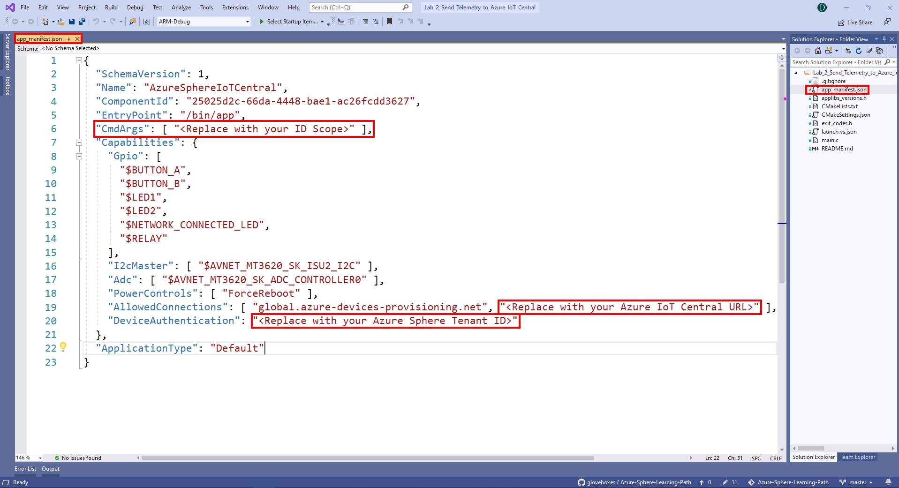

2. Update the Azure IoT Central Application connection properties.
    * Update **CmdArgs** with your Azure IoT Central **ID Scope**. 
    * Update **DeviceAuthentication** with your **Azure Sphere Tenant ID**. Remember, this was the numeric value output from the ```azsphere tenant show-selected``` command that you copied to Notepad.

3. Update the network endpoints whitelist with your Azure IoT Central Application URL. You copied these URLs into _Notepad_.
    * Update **AllowedConnections** with your **Azure IoT Central Application URLs**. 

4. **Review** your updated manifest_app.json file. It should look similar to the following.

    ```json
    {
        "SchemaVersion": 1,
        "Name": "AzureSphereIoTCentral",
        "ComponentId": "25025d2c-66da-4448-bae1-ac26fcdd3627",
        "EntryPoint": "/bin/app",
        "CmdArgs": [ "0ne0099999D" ],
        "Capabilities": {
            "Gpio": [
            "$BUTTON_A",
            "$BUTTON_B",
            "$LED1",
            "$LED2",
            "$NETWORK_CONNECTED_LED",
            "$RELAY"
            ],
            "I2cMaster": [ "$AVNET_MT3620_SK_ISU2_I2C" ],
            "PowerControls": [ "ForceReboot" ],
            "AllowedConnections": [ "global.azure-devices-provisioning.net", "iotc-9999bc-3305-99ba-885e-6573fc4cf701.azure-devices.net", "iotc-789999fa-8306-4994-b70a-399c46501044.azure-devices.net", "iotc-7a099966-a8c1-4f33-b803-bf29998713787.azure-devices.net", "iotc-97299997-05ab-4988-8142-e299995acdb7.azure-devices.net", "iotc-d099995-7fec-460c-b717-e99999bf4551.azure-devices.net", "iotc-789999dd-3bf5-49d7-9e12-f6999991df8c.azure-devices.net", "iotc-29999917-7344-49e4-9344-5e0cc9999d9b.azure-devices.net", "iotc-99999e59-df2a-41d8-bacd-ebb9999143ab.azure-devices.net", "iotc-c0a9999b-d256-4aaf-aa06-e90e999902b3.azure-devices.net", "iotc-f9199991-ceb1-4f38-9f1c-13199992570e.azure-devices.net" ],
            "DeviceAuthentication": "9d7e79eb-9999-43ce-9999-fa8888888894"
        },
        "ApplicationType": "Default"
    }
    ```

4. **IMPORTANT**. Copy the contents of your **app_manifest.json** file to **notepad** as you will need this configuration information for the next labs.

---

## Build, Deploy and Debug the Azure Sphere Application

### Sending telemetry to Azure IoT Central

Open **main.c**, and scroll down to the **MeasureSensorHandler** function.

>Pro Tip. Use the **Function Navigator** dropdown for quick code navigation. Click on the dropdown list, then select and click the function name. You will often see a function name listed twice in the dropdown. The first is the function forward signature, and the second is the implementation of the function.


In the **MeasureSensorHandler** function there is a call to **SendMsgLed2On(msgBuffer);**.

```c
/// <summary>
/// Read sensor and send to Azure IoT
/// </summary>
static void MeasureSensorHandler(EventLoopTimer* eventLoopTimer)
{
	if (ConsumeEventLoopTimerEvent(eventLoopTimer) != 0)
	{
		lp_terminate(ExitCode_ConsumeEventLoopTimeEvent);
		return;
	}
	if (lp_readTelemetry(msgBuffer, JSON_MESSAGE_BYTES) > 0)
	{
		SendMsgLed2On(msgBuffer);
	}
}
```

Function **SendMsgLed2On** will turn on LED2, then **SendMsg(message)** is called to send a JSON formatted message to Azure IoT Central.

```c
/// <summary>
/// Turn on LED2, send message to Azure IoT and set a one shot timer to turn LED2 off
/// </summary>
static void SendMsgLed2On(char* message)
{
	lp_gpioOn(&led2);
	Log_Debug("%s\n", message);
	lp_sendMsg(message);
	lp_setOneShotTimer(&led2BlinkOffOneShotTimer, &led2BlinkPeriod);
}
```

### Step 1: Set the build configuration

Before building the application with Visual Studio, ensure the ARM-Debug and GDB Debugger (HLCore) options are selected.


### Step 2: Start the Azure Sphere Application

To start the build, deploy, debug process, either click the Visual Studio **Start Selected Item** icon, or press **<kbd>F5</kbd>**, or from the Visual Studio main menu, click **Debug**, then **Start**.


### Step 3: View debugger output

Open the **Output** window to view the output from **Log_Debug** statements in the code. You will see the device negotiating security, and then it will start sending telemetry to Azure IoT Central.

You can open the output window by using the Visual Studio <kbd>Ctrl+Alt+O</kbd> shortcut or click the **Output** tab found along the bottom/right of Visual Studio.

#### Notes

1. Ensure **Device Output** is selected from the **Show output from** dropdown list.
2. You may see a couple of *ERROR: failure to create IoTHub Handle* messages displayed. These messages occur while the connection to IoT Central is being established.


---

## Expected Device Behaviour

### Avnet Azure Sphere MT3620 Starter Kit

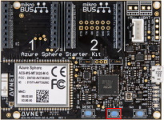

1. The blue LED will start to blink.
2. LED3 will turn yellow when connected to Azure. 
3. Press **Button A** on the device to change the blink rate.

### Seeed Studio Azure Sphere MT3620 Development Kit


1. The green LED will start to blink.
2. The network LED will turn red when connected to Azure.
3. Press **Button A** on the device to change the blink rate.

### Seeed Studio MT3620 Mini Dev Board


1. The green LED closest to the USB connector will start to blink.
2. Given there are no builtin buttons, virtual **Button A** and **Button B** presses will be generated every 5 seconds.
3. The virtual button presses will also change the blink rate.

---

## Step 3: View the device telemetry on the Azure IoT Central Dashboard

1. Switch back to Azure IoT Central in your web browser.
2. You need to wait a minute or two before your Azure Sphere device is automatically enrolled.
3. The newly enrolled device will have a numeric name that matches your Azure Sphere Device ID.
4. To display your Azure Sphere Device ID, start the **Azure Sphere Developer Command Prompt** and run the following command.

    ```bash
    azsphere device show-attached
    ```

---

## Step 4: Migrate your device to the Azure Sphere Template

You need to **Migrate** the newly enrolled device to the **Azure Sphere** template. The template maps the JSON formatted telemetry to the dashboard.

1. Select the newly enrolled device from the **All devices** template.
2. Click **Migrate**

    

3. Select the Azure Sphere Template, and then click migrate.

    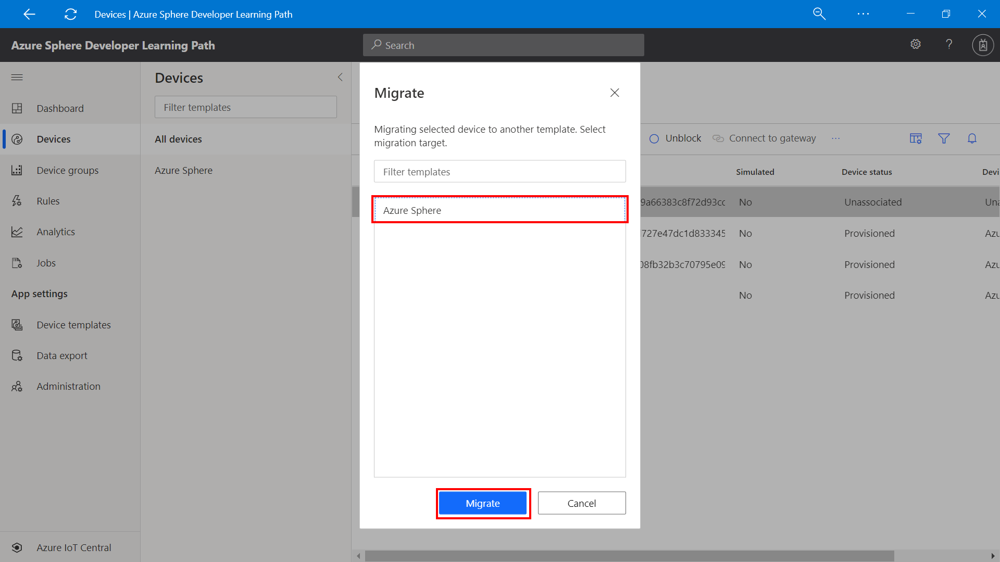

---

## Step 5: Display the Azure Sphere device telemetry

1. Click **Devices** on the sidebar.
2. Select the **Azure Sphere** template.
3. Click on the migrated device.
4. Select the **Telemetry** tab to view the device telemetry.
5. Rename your device. Click the **Rename** button and give your device a friendly name.


---

## Step 6: Displaying Azure IoT Central Events

1. Ensure the **Telemetry** tab is still displayed.
3. For Azure Sphere devices with builtin buttons, press **Button A** and **Button B** repeatedly to generate button alerts. 

	>Virtual button press events are generated for Azure Sphere devices that do not have builtin buttons. 

It may take a minute or two for temperature, humidity, button pressed alerts, and message count to be displayed in IoT Central. Changing tabs can speed can prompt a data refresh.

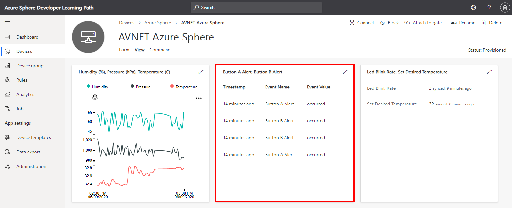

---

## In Review

We learned the following:

1. How to create an Azure IoT Central Application from a template.

2. Enabling trust between your Azure Sphere Tenant and your Azure IoT Central Application for automatic device enrollment.

3. Whitelisting the Azure IoT Central Application URL endpoint.

4. Configuring the Azure Sphere Application to connect to Azure IoT Central.

---

## Close Visual Studio

Now close **Close Visual Studio**.

---

## Finished 完了 fertig finito समाप्त terminado

Congratulations you have finished Lab 2.


---

**[NEXT](../Lab_3_Control_Device_with_Device_Twins_and_Direct_Methods/README.md)**

---
