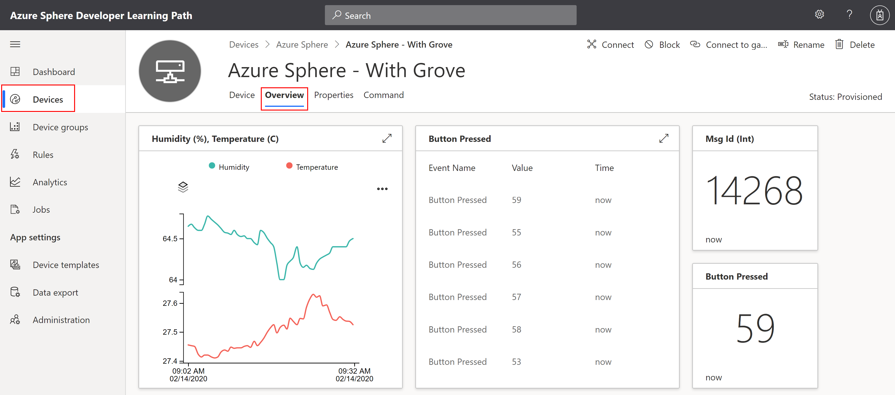
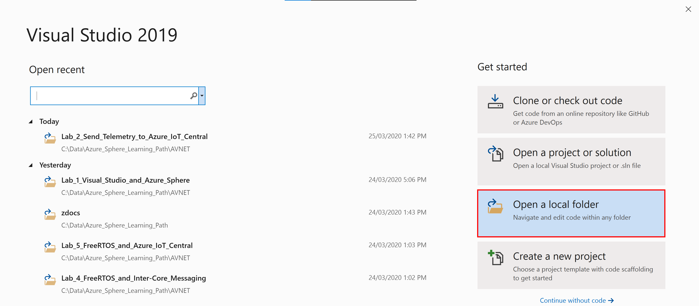
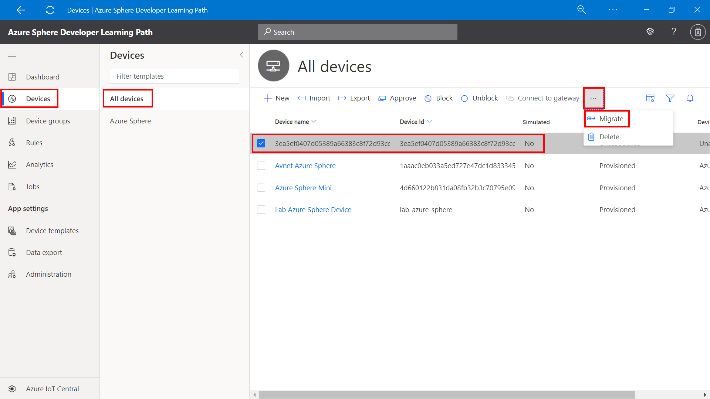

# Lab 2: Send Telemetry from an Azure Sphere to Azure IoT Central

<!--  -->

---

|Author|[Dave Glover](https://developer.microsoft.com/en-us/advocates/dave-glover?WT.mc_id=github-blog-dglover), Microsoft Cloud Developer Advocate, [@dglover](https://twitter.com/dglover) |
|:----|:---|
|Source Code | https://github.com/gloveboxes/Azure-Sphere-Learning-Path.git |
|Date| January  2020|

---

## Azure Sphere Learning Path

Each module assumes you have completed the previous module.

[Home](https://github.com/gloveboxes/Azure-Sphere-Learning-Path/blob/master/README.md)

* Lab 0: [Introduction Azure Sphere and Lab Set Up](/zdocs/Lab_0_Introduction_and_Lab_Set_Up/README.md)
* Lab 1: [Build your first Azure Sphere Application with Visual Studio](/zdocs/Lab_1_Visual_Studio_and_Azure_Sphere/README.md)
* Lab 2: [Send Telemetry from an Azure Sphere to Azure IoT Central](/zdocs/Lab_2_Send_Telemetry_to_Azure_IoT_Central/README.md)
* Lab 3: [Control an Azure Sphere with Device Twins and Direct Methods](/zdocs/Lab_3_Control_Device_with_Device_Twins_and_Direct_Methods/README.md)
* Lab 4: [Integrating FreeRTOS with Azure Sphere Inter-Core Messaging](/zdocs/Lab_4_FreeRTOS_and_Inter-Core_Messaging/README.md)
* Lab 5: [Integrating FreeRTOS with Azure IoT Central](/zdocs/Lab_5_FreeRTOS_and_Azure_IoT_Central/README.md)
* Lab 6: [Mass Device Deployment with Azure IoT Central](/zdocs/Lab_6_Mass_Device_Deployment/README.md)

---

## What you will learn

You will learn how to build a High Level [Azure Sphere](https://azure.microsoft.com/services/azure-sphere/?WT.mc_id=github-blog-dglover) application that connects and sends telemetry to [Azure IoT Central](https://azure.microsoft.com/services/iot-central/?WT.mc_id=github-blog-dglover).

---

## Prerequisites

The lab assumes you understand the content from [Lab 1: Secure, Build, Deploy and Debug your first Azure Sphere High-Level Application with Visual Studio](../Lab_1_Visual_Studio_and_Azure_Sphere/README.md)

## Tutorial Overview

1. Create an Azure IoT Central Application (Free trial)
2. Link your Azure IoT Central to your Azure Sphere Tenant
3. Deploy an Azure IoT Central enabled application to Azure Sphere

---

## Key Concepts

### Azure IoT

Your Azure Sphere device can securely connect and communicate with cloud services. Azure Sphere includes built-in library support for both Azure IoT Hub and Azure IoT Central. This lab focuses on Azure IoT Central.

This project leverages the [Azure IoT Hub Device Provisioning Service (PDS)](https://docs.microsoft.com/en-us/azure-sphere/app-development/use-azure-iot?WT.mc_id=github-blog-dglover) which is included with Azure IoT Central. The Device Provisioning Service (DPS) enables zero-touch, just-in-time, large scale device provisioning.

### Azure IoT Central

[Azure IoT Central](https://azure.microsoft.com/en-in/services/iot-central/?WT.mc_id=github-blog-dglover) provides an easy way to connect, monitor and manage your Internet of Things (IoT) assets at scale.


---

## Getting Started with Azure IoT Central

We are going to create an Azure IoT Central application from an application template.

---

## Step 1: Create an Azure IoT Central Application

For this lab, we are going to create an Azure IoT Central Application from a predefined template.

Right mouse click [Azure Sphere Learning Path Azure IoT Central Template](https://apps.azureiotcentral.com/build/new/107ea05b-c031-4866-a0f3-60c934551ac7) to open in a new browser tab.

### Configure the Azure IoT Central Template

1. Name your application
2. Select the **Free** pricing plan


When you have connected your Azure Sphere to Azure IoT Central you will be able to visualize the device telemetry.



<!-- Follow instructions to **[Create an Azure IoT Central Application](resources/azure-iot-central/azure-iot-central.md)** -->

---

## Link Azure IoT Central with your Azure Sphere Tenant

You must **link** your Azure IoT Central Application with the Azure Sphere Tenant that your Azure Sphere was claimed into.

**Right mouse click, and open in a new tab the [instructions to set up Azure IoT Central to work with Azure Sphere](https://docs.microsoft.com/en-au/azure-sphere/app-development/setup-iot-central?WT.mc_id=github-blog-dglover#step-2-download-the-tenant-authentication-ca-certificate)**.

---

## Azure IoT Central Connection Information

The Azure Sphere device requires the following information to connect to your Azure IoT Central Application.

1. The **Azure IoT Central Application**:
    * **Scope ID**,
    * and the **Application URI**.
2. The **Azure Sphere Tenant ID**.

### Azure IoT Central Application Information

Follow these steps to get the Azure IoT Central **Scope ID**, and the **Application URI**.

1. Start the **Azure Sphere Developer Command Prompt**
2. From the command prompt, navigate to the folder you cloned the **Azure Sphere** lab into.
3. Change directory to **tools**.
4. Run the **```ShowIoTCentralConfig.exe```** command.

    * When prompted, log in with your **Azure IoT Central credentials**.

    * The output from the **ShowIoTCentralConfig** will be similar to the following.

        ```text
        Are you using a Work/School account to sign in to your IoT Central Application (Y/N) ?

        Getting your IoT Central applications
        You have one IoT Central application 'yourappname-iot-central'.
        Getting the Device Provisioning Service (DPS) information.
        Getting a list of IoT Central devices.

        Find and modify the following lines in your app_manifest.json:
        "CmdArgs": [ "0ne9992KK6D" ],
        "AllowedConnections": [ "global.azure-devices-provisioning.net", "saas-iothub-9999999-f33a-4002-4444-7ca8989898989.azure-devices.net" ],
        "DeviceAuthentication": "--- YOUR AZURE SPHERE TENANT ID--- "
        ```
5. Open **Notepad**
6. Copy **two lines** from the output of _ShowIoTCentralConfig_ to **Notepad**. The following lines are required. Note, your values will be different.
    * ```"CmdArgs": [ "0ne9992KK6D" ]```
    * ```"AllowedConnections": [ "global.azure-devices-provisioning.net", "saas-iothub-9999999-f33a-4002-4444-7ca8989898989.azure-devices.net" ]```

    The **CmdArgs** value is the **Scope ID** of your Azure IoT Central Application. The **Allowed connections** values includes the global URI for the Device Provision Service, followed by the your **Azure IoT Central Application URI**.

5. **Copy these two lines to _Notepad_** as you will need it soon.

### Azure Sphere Tenant ID

1. From the **Azure Sphere Developer Command Prompt**, run **```azsphere tenant show-selected```**.
    * The output of this command will look similar to the following.
        ```text
        Default Azure Sphere tenant ID is 'yourSphereTenant' (99999999-e021-43ce-9999-fa9999499994).
        ```
    * The **Tenant ID** is the numeric value inside the parentheses.
2. **Copy the Tenant ID to _Notepad_** as you will need it soon.

---

## Open Lab 2

### Step 1: Start Visual Studio 2019



### Step 2: Open the lab project

1. Click **Open a local folder**
2. Open the Azure-Sphere lab folder
3. Open the **folder name** that corresponds to the **Azure Sphere board** you are using
4. Open the **Lab_2_Send_Telemetry_to_Azure_IoT_Central** folder
5. Click **Select Folder** button to open the project

### Step 3: Configure the Azure Sphere Application

1. Open the **app_manifest.json** file
    


2.  Update the **app_manifest.json** with the information you saved to **notepad**:

    * **CmdArgs**: Update with your Azure IoT Central Scope ID.
    * **AllowedConnections**: Update with your Azure IoT Central Application URI.
    * **DeviceAuthentication**: Your Azure Sphere Tenant ID. Remember, this was the numeric value output from the ```azsphere tenant show-selected``` command.

3. Review your **manifest_app.json** file. It should look similar to the following when you have updated it.

    ```json
    {
        "SchemaVersion": 1,
        "Name": "AzureSphereIoTCentral",
        "ComponentId": "25025d2c-66da-4448-bae1-ac26fcdd3627",
        "EntryPoint": "/bin/app",
        "CmdArgs": [ "Fake", "0ne0099999D" ],
        "Capabilities": {
            "Gpio": [ "$AVNET_MT3620_SK_GPIO0", "$AVNET_MT3620_SK_APP_STATUS_LED_YELLOW", "$AVNET_MT3620_SK_WLAN_STATUS_LED_YELLOW" ],
            "Uart": [],
            "I2cMaster": [ "$AVNET_MT3620_SK_ISU2_I2C" ],
            "Adc": [ "$AVNET_MT3620_SK_ADC_CONTROLLER0" ],
            "AllowedConnections": [ "global.azure-devices-provisioning.net", "saas-iothub-99999999-f33a-9999-a44a-7c99999900b6.azure-devices.net" ],
            "DeviceAuthentication": "9d7e79eb-9999-43ce-9999-fa8888888894"
        },
        "ApplicationType": "Default"
    }
    ```

4. **Important**. Copy the contents of the **app_manifest.json** file to **notepad** as you will need this configuration information for the next labs.

---

## Build, Deploy and Debug the Azure Sphere Application

Before building the application with Visual Studio ensure ARM-Debug and GDB Debugger (HLCore) options are selected.


### Sending Telemetry to Azure IoT Central

In **main.c**, scroll down to the **MeasureSensorHandler** C Function. In this function there is a call to **SendMsg(msgBuffer);**. This will send the JSON telemetry to Azure IoT Central.

```c
static void MeasureSensorHandler(EventLoopTimer* eventLoopTimer)
{
	if (ConsumeEventLoopTimerEvent(eventLoopTimer) != 0) {
		Terminate();
		return;
	}

	GPIO_ON(builtinLed); // blink send status LED

	if (ReadTelemetry(msgBuffer, JSON_MESSAGE_BYTES) > 0) {
		Log_Debug("%s\n", msgBuffer);
		SendMsg(msgBuffer);
	}

	GPIO_OFF(builtinLed);
}
```

### Start the Azure Sphere Application

To start the build, deploy, debug process, either click the Visual Studio **Start Selected Item** icon or press **<kbd>F5</kbd>**. To Build and deploy without attaching the debugger, simply press **<kbd>Ctrl+F5</kbd>**.


---

## Migrate your device to an Azure IoT Central Template

1. Open the Azure IoT Central Application you created.
2. For the next steps, you may need to **wait a minute or two** for **Azure IoT Central** to be updated.
3. Open the **Devices** tab. You may need to wait a minute or two, but eventually there will be a new device listed with a numeric name. 
This numeric name is the ID of your Azure Sphere Device. You can check this by running the  ```azsphere device show``` command from the *Azure Sphere Command Prompt*.
4. Select this new device and click **Migrate**
    
5. Migrate the Azure Sphere device to the **Azure Sphere** Template
    

---

## Azure IoT Central Dashboard

You may need to wait a minute or two before the telemetry is displayed on the **Overview** tab.

Note, you can also rename the device but clicking on the **Rename** button.


## Close Visual Studio

Now close **Close Visual Studio**.

---

## Finished 完了 fertig finito ख़त्म होना terminado

Congratulations you have finished Lab 2.


---

**[NEXT](../Lab_3_Control_Device_with_Device_Twins_and_Direct_Methods/README.md)**
