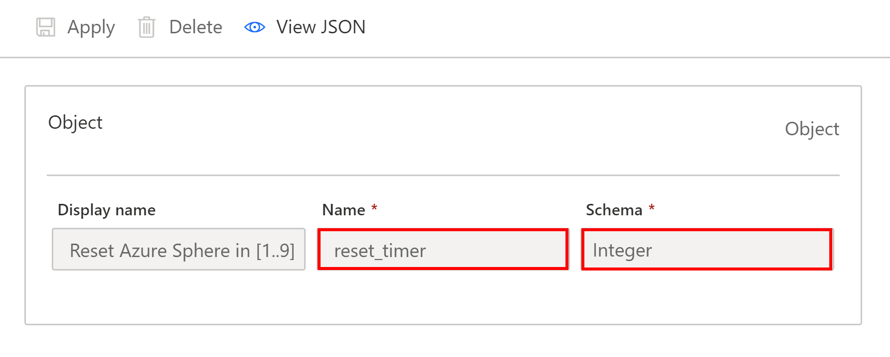
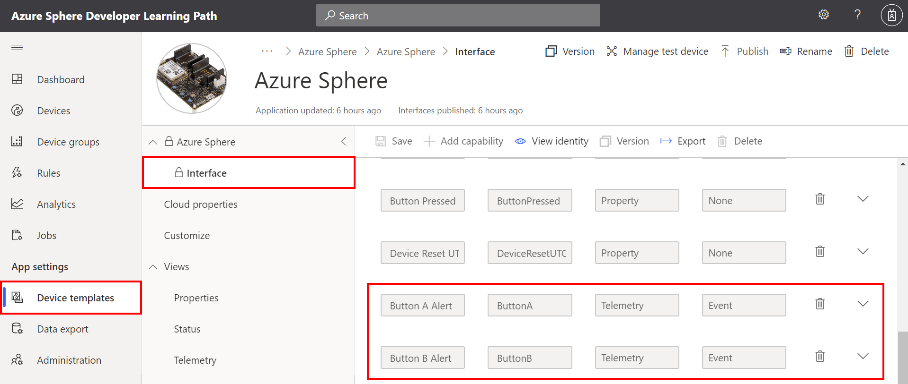
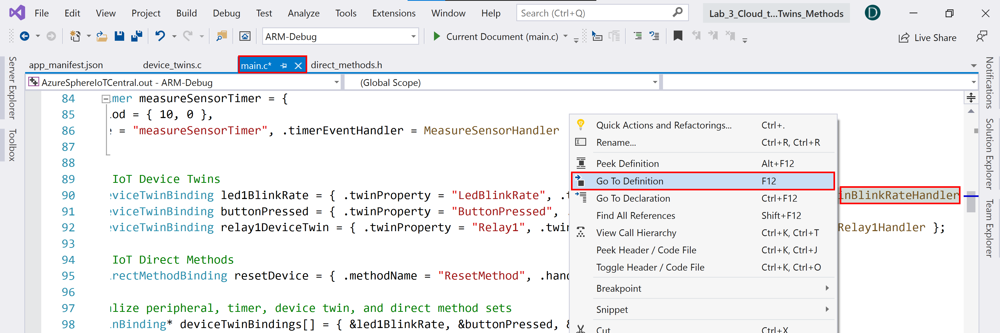
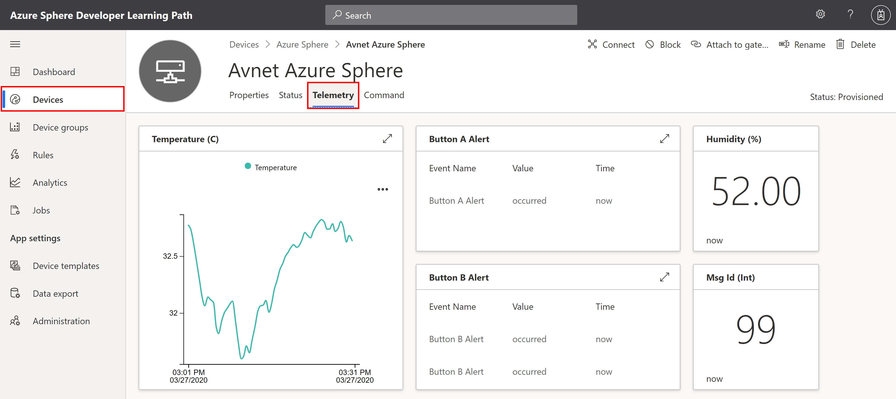
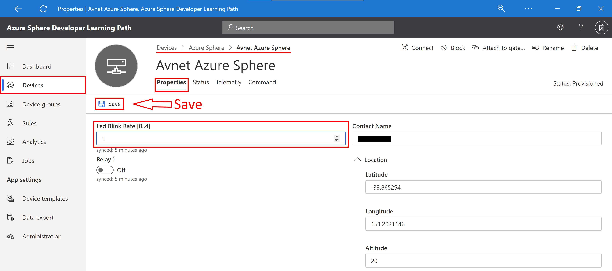
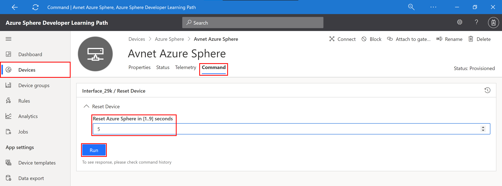
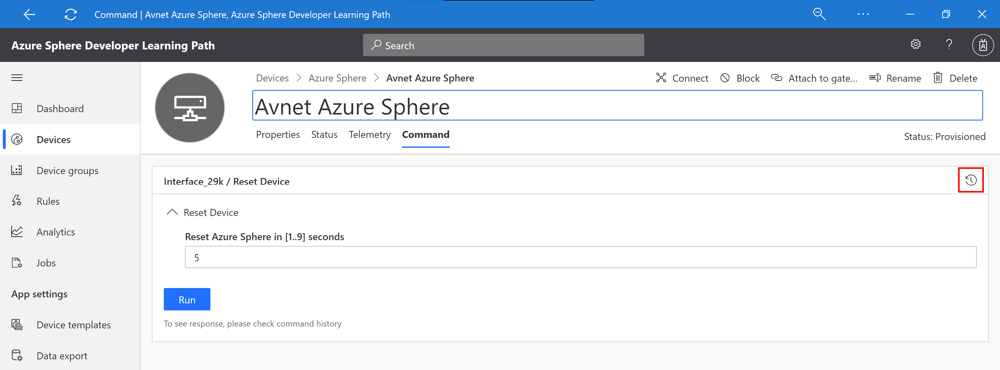
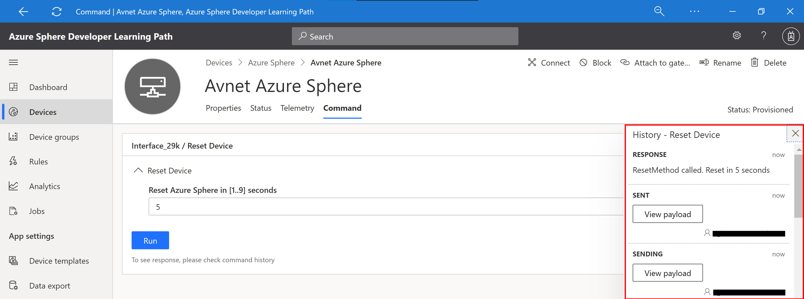
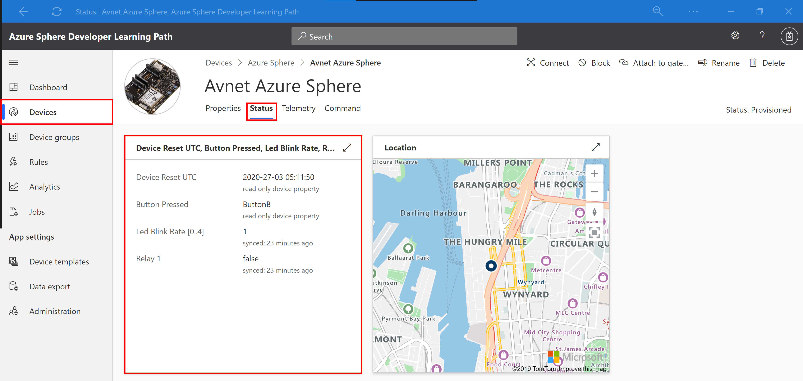

# Lab 3: Control an Azure Sphere with Device Twins and Direct Methods

---

|Author|[Dave Glover](https://developer.microsoft.com/en-us/advocates/dave-glover?WT.mc_id=github-blog-dglover), Microsoft Cloud Developer Advocate, [@dglover](https://twitter.com/dglover) |
|:----|:---|
|Source Code | https://github.com/gloveboxes/Azure-Sphere-Learning-Path.git |
|Date| March 2020|

---

## Azure Sphere Learning Path

Each module assumes you have completed the previous module.

[Home](https://github.com/gloveboxes/Azure-Sphere-Learning-Path/blob/master/README.md)

* Lab 0: [Introduction Azure Sphere and Lab Set Up](/zdocs/Lab_0_Introduction_and_Lab_Set_Up/README.md)
* Lab 1: [Build your first Azure Sphere Application with Visual Studio](/zdocs/Lab_1_Visual_Studio_and_Azure_Sphere/README.md)
* Lab 2: [Send Telemetry from an Azure Sphere to Azure IoT Central](/zdocs/Lab_2_Send_Telemetry_to_Azure_IoT_Central/README.md)
* Lab 3: [Control an Azure Sphere with Device Twins and Direct Methods](/zdocs/Lab_3_Control_Device_with_Device_Twins_and_Direct_Methods/README.md)
* Lab 4: [Integrating FreeRTOS with Azure Sphere Inter-Core Messaging](/zdocs/Lab_4_FreeRTOS_and_Inter-Core_Messaging/README.md)
* Lab 5: [Integrating FreeRTOS with Azure IoT Central](/zdocs/Lab_5_FreeRTOS_and_Azure_IoT_Central/README.md)
* Lab 6: [Mass Device Deployment with Azure IoT Central](/zdocs/Lab_6_Mass_Device_Deployment/README.md)

---

## What you will learn

You will learn how to control an [Azure Sphere](https://azure.microsoft.com/services/azure-sphere/?WT.mc_id=github-blog-dglover) application using [Azure IoT Central](https://azure.microsoft.com/services/iot-central/?WT.mc_id=github-blog-dglover) Properties and Commands.

---

## Prerequisites

This lab assumes you have completed [Lab 2: Send Telemetry from an Azure Sphere to Azure IoT Central](../Lab_2_Send_Telemetry_to_Azure_IoT_Central/README.md). You will have created an Azure IoT Central application, connected Azure IoT Central to your Azure Sphere Tenant, and you have configured the **app_manifest.json** for Azure IoT Central.

---

## Tutorial Overview

There are three ways that Azure IoT cloud applications can communicate with devices. 

[Direct Methods](https://docs.microsoft.com/en-us/azure/iot-hub/iot-hub-devguide-direct-methods) for communications that require immediate confirmation of the result. Direct methods are often used for interactive control of devices, such as turning on a fan.

[Device Twins](https://docs.microsoft.com/en-us/azure/iot-hub/iot-hub-devguide-device-twins) for long-running commands intended to put the device into a certain desired state. For example, set the sample rate for a sensor to every 30 minutes.

[Cloud-to-device](https://docs.microsoft.com/en-us/azure/iot-hub/iot-hub-devguide-messages-c2d) messages for one-way notifications to the device app.

This lab will cover Azure IoT Device Twins and Direct Methods.

---

## Key Concepts

In Lab 1, **Peripherals** and **Event Timers** were introduced to simplify and describe GPIO pins and Event Timers and their interactions.

In this lab, **DeviceTwinBindings**, and **DirectMethodBindings** are introduced to simplify the implementation of Azure IoT [Device Twins](https://docs.microsoft.com/en-us/azure/iot-hub/iot-hub-devguide-device-twins?WT.mc_id=github-blog-dglover) and Azure IoT [Direct Methods](https://docs.microsoft.com/en-us/azure/iot-hub/iot-hub-devguide-direct-methods?WT.mc_id=github-blog-dglover) on the device.

Both Device Twins and Direct Methods provide a mechanism to invoke functionality on a device from a custom Azure IoT Hub application or from an Azure IoT Central Application. For example, you may want to turn on a light, start a fan, or change the sensor sample rate.

---

## Azure IoT Device Twins

Device twins are JSON documents that store device information including metadata, configurations, and conditions. Azure IoT Hub keeps a device twin for each device that you connect to IoT Hub. Azure IoT Central is an application built on Azure IoT Hub and it uses device twins. 

You can use device twins as follows: 

1. Cloud to device updates.

	A user sets an Azure IoT Central device property. For example, to set the temperature of a refrigerator. To do this, IoT Central sends a desired property device twin message to the device. The device implements the desire property, and the device responds with a reported property device twin message. Azure IoT Hub stores the reported property. 
2. Device to cloud updates.

	A device can send a reported property device twin message to Azure. For example, it may report its firmware level on startup.  Azure IoT Hub stores the reported property. 

3. Querying reported properties.

	With reported state stored in Azure it is possible to query the stored device twin properties cloud side. For example, list all devices with a firmware version less than 2.0, as these devices require an updated. Or, list all refrigerators with a temperature setting greater than 3 degrees Celsius. 

The following outlines how Azure IoT Central uses Device Twins to set properties on a device: 

1. A user sets the value of a property in Azure IoT Central. For example, change the blink rate of a status LED. 
2. Azure IoT sends a desired property message to the device. 
3. The device implements the desired property; in this case, change the LED blink rate. 
4. The device sends reported property message back to Azure IoT. In this example, the device would report the new LED blink rate. 
5. Azure IoT Central queries and displays the devices reported property data. 


For more information, refer to the [Understand and use device twins in IoT Hub](https://docs.microsoft.com/en-us/azure/iot-hub/iot-hub-devguide-device-twins?WT.mc_id=github-blog-dglover) article.

---

## Device Twin Bindings

Azure IoT Central properties are implemented using device twins. Device Twin Bindings map a device twin with a device property and a handler function that implements the action.

### Cloud to Device Updates

In main.c the variable named **led1BlinkRate** of type **DeviceTwinBinding**  is declared. This variable maps the Azure IoT Central *LedBlinkRate* property with a handler function named **DeviceTwinBlinkRateHandler**.

```c
static DeviceTwinBinding led1BlinkRate = { 
	.twinProperty = "LedBlinkRate", 
	.twinType = TYPE_INT, 
	.handler = DeviceTwinBlinkRateHandler 
};
```


The following is the **DeviceTwinBlinkRateHandler** implementation. The handler function is called when the device receives a **LedBlinkRate** device twin desired property message from Azure IoT Central.

```c
/// <summary>
/// Set Blink Rate using Device Twin "LedBlinkRate": {"value": 0}
/// </summary>
static void DeviceTwinBlinkRateHandler(DeviceTwinBinding* deviceTwinBinding) {
	switch (deviceTwinBinding->twinType) {
	case TYPE_INT:
		Log_Debug("\nInteger Value '%d'\n", *(int*)deviceTwinBinding->twinState);

		Led1BlinkIntervalIndex = *(int*)deviceTwinBinding->twinState % led1BlinkIntervalsCount;
		ChangeTimer(&led1BlinkTimer, &led1BlinkIntervals[Led1BlinkIntervalIndex]);

		break;
	default:
		break;
	}
}
```

### Device to Cloud Updates

You can also define a Device to Cloud DeviceTwinBinding. The following example binds the Device Twin property ButtonPressed. Note, there is no handler function registered as this is a one-way device to cloud binding.

```c
static DeviceTwinBinding buttonPressed = { 
	.twinProperty = "ButtonPressed", 
	.twinType = TYPE_STRING 
};
```

To update the Device Twin, call the DeviceTwinReportState function. You must pass in a value of the correct type, in this case, **TYPE_STRING** (aka char*). This example can be found in the **ButtonPressCheckHandler** handler function found in **main.c**.

```c
DeviceTwinReportState(&buttonPressed, "ButtonA");   // TwinType = TYPE_STRING
```

---

## Device Twin Bindings life cycle

Device Twin Bindings can be automatically opened, dispatched, and closed if they are added to the deviceTwinDevices **Set**.

```c
DeviceTwinBinding* deviceTwinBindingSet[] = { &led1BlinkRate, &buttonPressed, &relay1DeviceTwin, &deviceResetUtc };
```

### Opening

The Direct Method Bindings are initialized in the **InitPeripheralsAndHandlers** function found in **main.c**.

```c
OpenDeviceTwinSet(deviceTwinBindingSet, NELEMS(deviceTwinBindingSet));
```

### Dispatching

When a Device Twin message is received, the DeviceTwinBindings Set is checked for a matching DeviceTwinBinding *twinProperty* name. When a match is found, the corresponding DeviceTwinBinding handler function is called.

### Closing

The Direct Method Bindings are closed in the **ClosePeripheralsAndHandlers** function found in **main.c**.

```c
CloseDeviceTwinSet();
```

---

## Azure IoT Central Interface Properties

1. From Azure IoT Central, navigate to **Device template**, and select the **Azure Sphere** template.
2. Click on **Interfaces** to list the interface capabilities.
3. Scroll down and expand the **LedBlinkRate** capability.
4. Review the definition of **LedBlinkRate**. The capability type is **Property**, the Schema type is **Integer**, and the property is **Writeable**. Writeable means this property is enabled for Cloud to Device updates.

	


---

## Azure IoT Direct Methods

Azure IoT Direct Methods can be used to invoke an action on a device.  A Direct Method message includes the direct method name and a data payload. The device will action the request and then respond with an HTTP status code to indicate the success or failure of an action, along with an optional message.

The following outlines how Azure IoT Central Commands uses Direct Methods to invoke an action on a device:

1. A user invokes an Azure IoT Central Command. An Azure IoT sends a Direct Method message to the device. For example, reset the device. This message includes the method name and an optional payload. 
2. The device receives the direct method message and calls the associated handler function 
3. The device implements the direct method; in this case, reset the device. 
4. The device responds with an HTTP status code, and optionally a response message. 


For more information, refer to the [Understand and invoke direct methods from IoT Hub](https://docs.microsoft.com/en-us/azure/iot-hub/iot-hub-devguide-direct-methods?WT.mc_id=github-blog-dglover) article.

---

## Direct Method Bindings

Azure IoT Central commands are implemented using direct methods. Direct Method Bindings map a direct method with a handler function that implements the action.

### Declaring a Direct Method Binding

In the following example, when the device receives an Azure IoT Direct Method named **ResetMethod**, the **ResetDirectMethod** handler function will be called.

```c
static DirectMethodBinding resetDevice = { 
	.methodName = "ResetMethod", 
	.handler = ResetDirectMethod 
};
```

---

## Opening, Dispatching, and Closing Direct Method Bindings

Like Peripherals, Timers, and Device Twin Bindings, Direct Method Bindings can be automatically opened, dispatched, and closed if they are added to the directMethodBindings array. Direct Method Bindings added to the **directMethodBindings array** are referred to as a **set** of direct method bindings.

```c
DirectMethodBinding* directMethodBindingSet[] = { &resetDevice };
```

### Opening

The Direct Method Bindings are initialized in the **InitPeripheralsAndHandlers** function found in **main.c**.

```c
OpenDirectMethodSet(directMethodBindingSet, NELEMS(directMethodBindingSet));
```

### Dispatching

When a Direct Method message is received the DirectMethodBindings Set is checked for a matching DirectMethodBinding *methodName* name. When a match is found, the DirectMethodBinding handler function is called.

### Closing

The Direct Method Bindings are closed in the **ClosePeripheralsAndHandlers** function found in **main.c**.

```c
CloseDirectMethodSet();
```

---

## Mapping Direct Method Bindings to Azure IoT Central Interface Command

Azure IoT Central application template interface includes a command capability. The command capability defines a display name, a command named **ResetMethod**, and schema information. The command name maps to the DirectMethodBinding **methodName**.

From your web browser, switch back to the Azure IoT Central application and explore the Azure Sphere Device Template and the Interfaces.


#### ResetMethod Object Schema

The **ResetMethod** schema is of type **Object**. Clicking on the **view** button will display the object definition. The Object definition describes the shape of the JSON payload sent when the Direct Method is invoked.

The **ResetMethod** handler function expects a JSON payload shaped like this {"reset_timer":5}.



---

## Direct Method Handler Function

The following outlines how the **ResetDirectMethod** handler function found in **main.c** works:

1. From Azure IoT Central, a user invokes the **Reset Azure Sphere** command. A Direct Method named **ResetMethod**, along with a JSON payload, is sent to the device. The JSON payload *{"reset_timer":5}* specifies how many seconds to wait before resetting the device.

2. When the device receives a Direct Method message, the DirectMethodBindings Set is checked for a matching DirectMethodBinding *methodName* name. When a match is found, the associated DirectMethodBinding handler function is called.

3. The current UTC time is reported to Azure IoT using a Device Twin Binding property named **DeviceResetUTC**.

4. The Direct Method responds back with an HTTP status code and a response message

5. The device is reset.

6. Azure IoT Central queries and displays the Device Twin reported property **DeviceResetUTC**.


```c
/// <summary>
/// Start Device Power Restart Direct Method 'ResetMethod' {"reset_timer":5}
/// </summary>
static DirectMethodResponseCode ResetDirectMethod(JSON_Object* json, DirectMethodBinding* directMethodBinding, char** responseMsg) {
	const char propertyName[] = "reset_timer";
	const size_t responseLen = 60; // Allocate and initialize a response message buffer. The calling function is responsible for the freeing memory
	static struct timespec period;

	*responseMsg = (char*)malloc(responseLen);
	memset(*responseMsg, 0, responseLen);

	if (!json_object_has_value_of_type(json, propertyName, JSONNumber)) {
		return METHOD_FAILED;
	}
	int seconds = (int)json_object_get_number(json, propertyName);

	if (seconds > 0 && seconds < 10) {

		// Report Device Reset UTC
		DeviceTwinReportState(&deviceResetUtc, GetCurrentUtc(msgBuffer, sizeof(msgBuffer)));			// TYPE_STRING

		// Create Direct Method Response
		snprintf(*responseMsg, responseLen, "%s called. Reset in %d seconds", directMethodBinding->methodName, seconds);

		// Set One Shot Timer
		period = (struct timespec){ .tv_sec = seconds, .tv_nsec = 0 };
		SetOneShotTimer(&resetDeviceOneShotTimer, &period);

		return METHOD_SUCCEEDED;
	}
	else {
		snprintf(*responseMsg, responseLen, "%s called. Reset Failed. Seconds out of range: %d", directMethodBinding->methodName, seconds);
		return METHOD_FAILED;
	}
}
```

---

## Azure IoT Central Events

Azure IoT Central can be configured to treat some telemetry as events. You would typically use these for alerts or notifications. For example, an emergency button was pressed.

### Step 1: Defining Azure IoT Central Interface Events

Defined in the Azure IoT Central Device template, under Interface, ButtonA and ButtonB are configured as **Events**.



### Step 2: Generating Azure IoT Central Events

Review the handler function **ButtonPressCheckHandler**. The following code sends the Button Pressed events to Azure IoT Central.

```c
// Send ButtonA Pressed Event
if (snprintf(msgBuffer, JSON_MESSAGE_BYTES, cstrJsonEvent, cstrEvtButtonA) > 0) {
	SendMsgLed2On(msgBuffer);
}
```


These events are mapped to the following JSON formatted messages sent from the Azure Sphere:

* { "ButtonA": "occurred" }
* { "ButtonB": "occurred" }

### Step 3: Displaying Azure IoT Central Events

These events are displayed in the Azure Sphere template from under the Telemetry panel.


---

## Open Lab 3

### Step 1: Start Visual Studio 2019


### Step 2: Open the lab project

1. Click **Open a local folder**.
2. Open the Azure-Sphere lab folder.
3. Open the **folder name** that corresponds to your **Azure Sphere board**.
4. Open the **Lab_3_Cloud_to_Device_Control_Twins_Methods** folder.
5. Click **Select Folder** button to open the project.

    <!--  -->

### Step 3: Configure the Azure IoT Central Connection Information

1. Open the **app_manifest.json** file.
2. You will need to redo the settings for the **app_manifest.json** file. Either copy from **Notepad** if you still have it open or copy from the **app_manifest.json** file you created in lab 2.

    

3. Update the contents of this **app_manifest.json**.

---

<!-- ## Support for Azure IoT Central Properties

1. Open **main.c**.
2. Navigate to the C statement **static DeviceTwinBinding led1BlinkRate**. 

    * If you have Visual Studio line numbers enabled, then scroll down to about line 90. 
    * You can also use **find**, press <kbd>Ctrl+f</kbd>, and type *led1BlinkRate*.

    ```c
    static DeviceTwinBinding led1BlinkRate = { .twinProperty = "LedBlinkRate", .twinType = TYPE_INT, .handler = DeviceTwinBlinkRateHandler };
    ```

    This variable describes the Device Twin. Defined is the Azure IoT Central Device Twin **Property**, the data type, and the **handler** function named **DeviceTwinBlinkRateHandler**.

3. Right mouse click on **DeviceTwinBlinkRateHandler**, and select **Go To Definition**.
    .
4. This will take you to the handler function named **DeviceTwinBlinkRateHandler**.
5. Review the implementation of the handler.

### Support for Azure IoT Central Commands

1. Open **main.c**.
2. Navigate to the C statement **static DirectMethodBinding resetDevice**.
    * If you have Visual Studio line numbers enabled, then scroll down to about line 95. 
    * You can also use **find**, press <kbd>Ctrl+f</kbd>, and type *resetDevice*.

    ```c
	static DirectMethodBinding resetDevice = { .methodName = "ResetMethod", .handler = ResetDirectMethodHandler };
    ```

4. Right mouse click the **ResetDirectMethodHandler** handler and select **Go To Definition**.
5. Review the handler function implementation.

### Support for IoT Central Properties and Commands

1. Open **main.c**.
2. Press <kbd>Ctrl+f</kbd>, and search for **deviceTwinBindings**. In this code section, the **deviceTwinBindings** and **directMethodBindings** sets are declared.

    ```c
	DeviceTwinBinding* deviceTwinBindingSet[] = { &led1BlinkRate, &buttonPressed, &relay1DeviceTwin, &deviceResetUtc };
	DirectMethodBinding* directMethodBindingSet[] = { &resetDevice };
    ```

3. From main.c, navigate to the **InitPeripheralsAndHandlers** function. This is where the device twins and direct methods **sets** are opened.

    ```c
	/// <summary>
	///  Initialize peripherals, device twins, direct methods, timers.
	/// </summary>
	/// <returns>0 on success, or -1 on failure</returns>
	static int InitPeripheralsAndHandlers(void) {
		InitializeDevKit();

		OpenPeripheralSet(peripheralSet, NELEMS(peripheralSet));
		OpenDeviceTwinSet(deviceTwinBindingSet, NELEMS(deviceTwinBindingSet));
		OpenDirectMethodSet(directMethodBindingSet, NELEMS(directMethodBindingSet));

		StartTimerSet(timerSet, NELEMS(timerSet));

		return 0;
	}
    ```

--- -->

### Step 4: Visual Studio Deployment Settings

Before building the application with Visual Studio, ensure ARM-Debug and GDB Debugger (HLCore) options are selected.


---

### Step 5: Build, Deploy and start Debugging

To start the build, deploy, and debug process, either click the Visual Studio **Start Selected Item** icon or press <kbd>**F5**</kbd>. To Build and deploy without attaching the debugger, press <kbd>**Ctrl+F5**</kbd>.


---

## Expected Device Behaviour

### Avnet Azure Sphere MT3620 Starter Kit


1. The blue LED will start to blink
2. Press **Button A** on the device to change the blink rate and generate **Button Pressed Events**.
3. Press **Button B** on the device to generate **Button Pressed Events**.

### Seeed Studio Azure Sphere MT3620 Development Kit


1. The blue LED will start to blink
2. Press **Button A** on the device to change the blink rate and generate **Button Pressed Events**.
3. Press **Button B** on the device to generate **Button Pressed Events**.

### Seeed Studio MT3620 Mini Dev Board


1. The green LED closest to the USB connector will start to blink
2. Given no builtin buttons, virtual **Button A** and **Button B** presses will be generated every 5 seconds. The blink rate will change and **Button Pressed Events** will be generated.

---

## Viewing the Device Telemetry in Azure IoT Central

1. Switch to Azure IoT Central in your browser.
2. Select the **Devices**, then the **Azure Sphere** template, then your device.
3. Select the **Telemetry** tab.
4. Azure Sphere devices with builtin buttons, press **Button A** and **Button B** repeatedly to generate button alerts. 

	Virtual button press events are generated for Azure Sphere devices that do not have builtin buttons. 

Azure IoT Central does not update immediately. It may take a minute or two for temperature, humidity, button pressed alerts, and message count to be displayed.



## Testing Azure IoT Central Property Updates

Select the **Properties** tab, update the **Led Blink Rate [0..4]** field, then click **Save**.



---

## Testing Azure IoT Central Commands

1. From Visual Studio, ensure the Azure Sphere is running the application and set a breakpoint in the **ResetDirectMethod** handler function.
2. Switch to Azure IoT Central in your web browser.
3. Select the Azure IoT Central **Commands** tab.
4. Set the **Reset Azure Sphere** time in seconds, then click **Run**.
5. Observer the device rebooting. The LEDs will stop blinking for a few seconds.
    
6. Switch back to Visual Studio, the application should have stopped where you set the breakpoint. Step over code <kbd>F10</kbd>, step into code <kbd>F11</kbd>, and continue code execution <kbd>F5</kbd>.
7. Switch back to Azure IoT Central, and click the **View History** button.
    
8. The command history will be similar to the following:

	> Note, you may see a timed out message in the history depending on how long it took you to step through the code in Visual Studio.

    

---

## Viewing Reported Status

The **Status** tab displays the latest reported data from the Azure Sphere device.



---

## Close Visual Studio

Now close **Close Visual Studio**.

---

## Finished 完了 fertig finito ख़त्म होना terminado

Congratulations you have finished lab 3.


---

**[NEXT](../Lab_4_FreeRTOS_and_Inter-Core_Messaging/README.md)**

---
