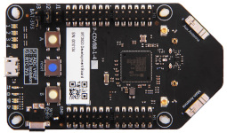
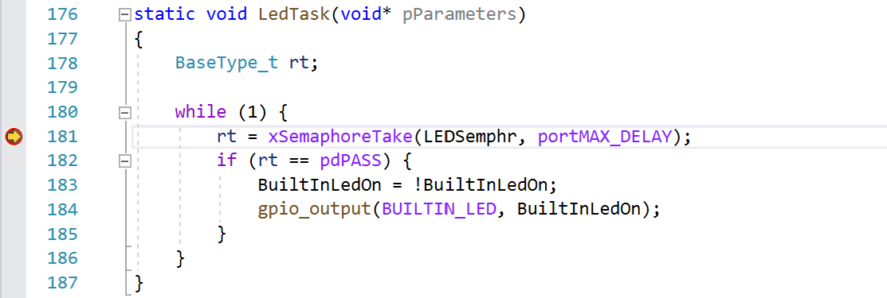

# Lab 4: Integrating FreeRTOS with Azure Sphere Inter-Core Messaging

<!--  -->

---

|Author|[Dave Glover](https://developer.microsoft.com/en-us/advocates/dave-glover?WT.mc_id=github-blog-dglover), Microsoft Cloud Developer Advocate, [@dglover](https://twitter.com/dglover) |
|:----|:---|
|Source Code | https://github.com/gloveboxes/Azure-Sphere-Learning-Path.git |
|Date| March  2020|

---

## Azure Sphere Learning Path

Each module assumes you have completed the previous module.

[Home](https://github.com/gloveboxes/Azure-Sphere-Learning-Path/blob/master/README.md)

* Lab 0: [Introduction Azure Sphere and Lab Set Up](/zdocs/Lab_0_Introduction_and_Lab_Set_Up/README.md)
* Lab 1: [Build your first Azure Sphere Application with Visual Studio](/zdocs/Lab_1_Visual_Studio_and_Azure_Sphere/README.md)
* Lab 2: [Send Telemetry from an Azure Sphere to Azure IoT Central](/zdocs/Lab_2_Send_Telemetry_to_Azure_IoT_Central/README.md)
* Lab 3: [Control an Azure Sphere with Device Twins and Direct Methods](/zdocs/Lab_3_Control_Device_with_Device_Twins_and_Direct_Methods/README.md)
* Lab 4: [Integrating FreeRTOS with Azure Sphere Inter-Core Messaging](/zdocs/Lab_4_FreeRTOS_and_Inter-Core_Messaging/README.md)
* Lab 5: [Integrating FreeRTOS with Azure IoT Central](/zdocs/Lab_5_FreeRTOS_and_Azure_IoT_Central/README.md)
* Lab 6: [Mass Device Deployment with Azure IoT Central](/zdocs/Lab_6_Mass_Device_Deployment/README.md)

---

## What you will learn

You will learn how to deploy a [FreeRTOS](https://www.freertos.org/) application to an Azure Sphere Cortex M4 Real-Time core.

You can run Bare Metal applications or applications built on Real-Time frameworks such as FreeRTOS and Azure RTOS on the Azure Sphere Real-Time cores.

The main reason you would run an application on a Real-Time core is when you need precise or highly deterministic timing. For example, you have a sensor driver that requires precise timing.

For security, applications running on Real-Time cores do not have direct internet access. They communicate with the internet via a High-Level application.

 In this lab, you will also learn about **Inter-Core** messaging.

---

## Prerequisites

None.

---

## Tutorial Overview

1. Enable Real-Time core development
2. Deploy your first FreeRTOS Application to Azure Sphere.

---

## Key Concepts

In this lab, you will learn how to secure, deploy, and debug a **Real-Time** FreeRTOS application running on one of the Azure Sphere **Cortex M4** Real-Time cores.

As a reminder, the Azure Sphere has three application cores. The Cortex A7 runs High-Level applications, the two Cortex M4s run Real-Time applications.

Like High-Level applications, Real-Time core applications are locked down by default, so you need to grant permissions to access hardware resources.

For security, applications running on Real-Time cores cannot connect directly to **any** network.

In this lab and the next, you will learn about  **Inter-Core** messaging. Inter-Core messaging provides a secure channel for applications running on different cores to communicate.


### Inter-Core Messaging Security

The FreeRTOS application will send **Button Pressed** events to the **Partner** High-Level application. The High-Level application will then forward the events to Azure IoT Central on behalf of the FreeRTOS application.

Both the FreeRTOS application running on the Real-Time core and the High-Level application need **Inter-Core** messaging permissions. The **app_manifest.json** property **AllowedApplicationConnections** of both applications must include the _Component ID_ of the **Partner** application.

In the following FreeRTOS Real-Time **app_manifest.json** file, the **AllowedApplicationConnections** property is set to the Component ID of the High-Level application.

```json
{
    "SchemaVersion": 1,
    "Name": "GPIO_RTApp_MT3620_BareMetal",
    "ComponentId": "6583cf17-d321-4d72-8283-0b7c5b56442b",
    "EntryPoint": "/bin/app",
    "CmdArgs": [],
    "Capabilities": {
        "Gpio": [ "$AVNET_AESMS_PIN13_GPIO10", "$AVNET_AESMS_PIN14_GPIO12" ],
        "AllowedApplicationConnections": [ "25025d2c-66da-4448-bae1-ac26fcdd3627" ]
    },
    "ApplicationType": "RealTimeCapable"
}
```

In the following High-Level **app_manifest.json** file, the **AllowedApplicationConnections** property is set to the Component ID of the FreeRTOS Real-Time application.

```json
{
  "SchemaVersion": 1,
  "Name": "AzureSphereIoTCentral",
  "ComponentId": "25025d2c-66da-4448-bae1-ac26fcdd3627",
  "EntryPoint": "/bin/app",
  "CmdArgs": [ "Real", "<Relplace with your Scope ID>", "6583cf17-d321-4d72-8283-0b7c5b56442b" ],
  "Capabilities": {
    "Gpio": [ "$AVNET_MT3620_SK_GPIO0", "$AVNET_MT3620_SK_APP_STATUS_LED_YELLOW", "$AVNET_MT3620_SK_WLAN_STATUS_LED_YELLOW" ],
    "Uart": [],
    "I2cMaster": [ "$AVNET_MT3620_SK_ISU2_I2C" ],
    "Adc": [ "$AVNET_MT3620_SK_ADC_CONTROLLER0" ],
    "AllowedConnections": [ "global.azure-devices-provisioning.net", "<Replace with your Azure IoT Central URI>" ],
    "DeviceAuthentication": "00000000-0000-0000-0000-000000000000",
    "AllowedApplicationConnections": [ "6583cf17-d321-4d72-8283-0b7c5b56442b" ]
  },
  "ApplicationType": "Default"
}
```

---

## Set up FreeRTOS Real-Time Core Development

### Step 1: Enable Real-Time Core Debugging

Run the **Azure Sphere Developer Command Prompt** as **Administrator**.

1. Press the <kbd>Windows Key</kbd>
2. Start typing **Azure Sphere Developer Command Prompt**
3. Select **Run as administrator**

4. Run

    ```bash
    azsphere device enable-development -r
    ```

5. Exit the command prompt, type **exit**, and press return.

### Step 2: Copy the Floating Point Toolchain

The **AzureSphereRTCoreToolchainVFP.cmake** file is required to build the FreeRTOS application.

Copy the **AzureSphereRTCoreToolchainVFP.cmake** file from **Azure Sphere Learning Path** directory to the system Azure Sphere SDK CMakeFiles directory. The Default destination path is **C:\Program Files (x86)\Microsoft Azure Sphere SDK\CMakeFiles**.

---

## Delete Existing Applications on the Azure Sphere

There will be some GPIO pin reassignments between the existing High-Level application that is running on the Azure Sphere and the new Real-Time application that will be deployed to the Azure Sphere in this lab. So delete any existing applications on the Azure Sphere to avoid any clashes.

From the **Azure Sphere Developer Command Prompt**, run

```bash
azsphere device sideload delete
```

---

## Open Lab 4

### Step 1: Start Visual Studio 2019


### Step 2: Open the lab project

1. Click **Open a local folder**
2. Open the Azure-Sphere lab folder
3. Open the **folder name** that corresponds to the **Azure Sphere board** you are using
4. Open the **Lab_4_FreeRTOS_and_Inter-Core_Messaging** folder
5. Click **Select Folder** button to open the project

---

## Deploy the FreeRTOS Application to Azure Sphere

1. Set the startup configuration. Select the **ARM-Debug** configuration and the **GDB Debugger (RTCore)** startup item.

    
3. Press <kbd>**F5**</kbd>, this will start the build, deploy, attach debugger process. The leftmost **blue LED** on the Azure Sphere will start **blinking**.

---

## Expected Behaviour

### Avnet Azure Sphere MT3620 Starter Kit


1. The blue LED will start to blink
2. Press **Button A** on the device to change the blink rate.

### Azure Sphere MT3620 Development Kit



1. The blue LED will start to blink
2. Press **Button A** on the device to change the blink rate.

### Seeed Studio MT3620 Mini Dev Board


1. The green LED, the one closest to the USB plug will start to blink.
2. The Seeed Studio Azure Sphere Mini developer kit does not have a built-in button, so every 10 seconds the blink rate will change automatically.

---

## Debugging Real-Time Core Applications

You can Debug the FreeRTOS application running on Azure Sphere Cortex M4 Real-Time Core.

1. From Visual Studio, open the FreeRTOS application **main.c** file.
2. Scroll down to the C function named **LedTask**.
3. Set a [Visual Studio Breakpoint](https://docs.microsoft.com/en-us/visualstudio/debugger/using-breakpoints?view=vs-2019) in the **LedTask** function on the line that reads **rt = xSemaphoreTake(LEDSemphr, portMAX_DELAY);**

    
4. The code will stop executing at the breakpoint
    
5.  You can now start stepping through the code by pressing <kbd>**F10**</kbd> to step over, <kbd>**F11**</kbd> to step into, or <kbd>**F5**</kbd> to continue.
6. Explorer debugging, hover the mouse over the variable named **BuiltInLedOn** and you can see its current value.
7. Click on the **red dot** to delete the breakpoint, and press <kbd>**F5**</kbd> to continue execution.

---

## Finished 完了 fertig finito ख़त्म होना terminado

**Do NOT** close or stop Visual Studio as we need the FreeRTOS application running for the next lab.

---

**[NEXT](../Lab_5_FreeRTOS_and_Azure_IoT_Central/README.md)**

---
