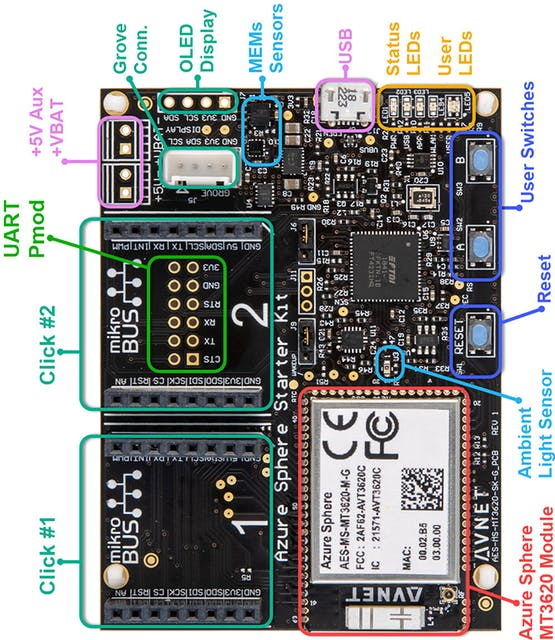
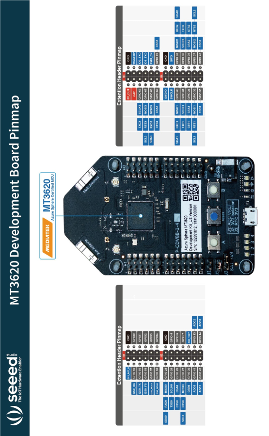
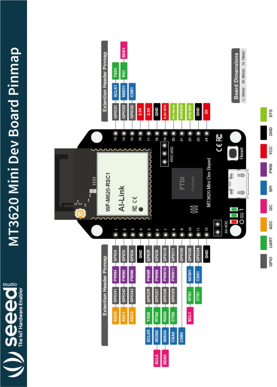

# Lab 1: Introduction to Azure Sphere development

<!--  -->

---

|Author|[Dave Glover](https://developer.microsoft.com/en-us/advocates/dave-glover?WT.mc_id=github-blog-dglover), Microsoft Cloud Developer Advocate, [@dglover](https://twitter.com/dglover) |
|:----|:---|
|Date| March 2020 |

---

## Azure Sphere Learning Path

Each module assumes you have completed the previous module.

[Home](../../README.md)

* Lab 0: [Lab Set Up](../Lab_0_Introduction_and_Lab_Set_Up/README.md)
* Lab 1: [Introduction to Azure Sphere development](../Lab_1_Visual_Studio_and_Azure_Sphere/README.md)
* Lab 2: [Connect a room environment monitor to Azure IoT](../Lab_2_Send_Telemetry_to_Azure_IoT_Central/README.md)
* Lab 3: [Set the room virtual thermostat with Azure IoT Device Twins](../Lab_3_Control_Device_with_Device_Twins/README.md)
* Lab 4: [Remote reboot your Azure Sphere with Azure IoT Direct Methods](../Lab_4_Control_Device_with_Direct_Methods/README.md)
* Lab 5: [Integrate FreeRTOS Real-time room sensors with Azure IoT](../Lab_5_FreeRTOS_and_Inter-Core_Messaging/README.md)
* Lab 6: [Integrate Azure RTOS Real-time room sensors with Azure IoT](../Lab_6_AzureRTOS_and_Inter-Core_Messaging/README.md)
* Lab 7: [Connect and control your room environment monitor with Azure IoT](../Lab_7_Azure_IoT_Central_RTOS_Integration/README.md)
<!-- * Lab 8: [Over-the-air (OTA) Deployment](/zdocs/Lab_8_Over-the-air-deployment/README.md) -->

---

## What you will learn

In this lab, you will learn how to secure, build, deploy, and debug your first High-Level (HL) Azure Sphere application onto the Azure Sphere A7 Core.

---

## Prerequisites

This lab assumes you have completed **Lab 0: Lab set up, installation and configuration**

---

## Introduction to the Learning Path Labs

There are a number of Learning Path libraries that support these labs. These Learning Path C functions are prefixed with **lp_**, typedefs and enums are prefixed with **LP_**. 

The Learning Path libraries are open source and contributions are welcome.

The Learning Path libraries are built from the [Azure Sphere Samples](https://github.com/Azure/azure-sphere-samples) and aim to demonstrate best practices.

The Learning Path libraries are **not** part of the official Azure Sphere libraries or samples.

---

## Tutorial Overview

1. Understand Peripheral and Event Timer concepts.
2. Open the lab project with Visual Studio
3. Review the High-Level (A7) Core application security requirements.
4. Understand device manufacture pin mappings.
5. Application deployment and debugging

---

## Key Concepts

In this lab you will learn about GPIO hardware interfaces, and event driven programming.

---

## Understanding Hardware

Most IoT solutions are designed to interface with hardware and interact with the real world. The most common interfaces on a device are GPIO, PWM, I2C, SPI, ADC, and UART.

### GPIO or General Purpose Input Output

Any GPIO pin can be designated (in software) as an input or output pin and can be used for a wide range of purposes. These labs use single pin GPIO peripherals for input and output, so the following is an introduction to GPIO pins.

**GPIO Output**

If a GPIO pin is designated as an *output* pin, then the software running on the Azure Sphere can set a pin to be either on or off. This equates to 3.3 volts for a pin that has been turned on, and zero volts when turned off. It is important to check that a peripheral connected to the pin is 3.3 volts tolerant. Otherwise you may destroy the peripheral. Lots of peripherals use single pins such as LEDs, relays, reed switches.

**GPIO Input**

If a GPIO pin is designated as an *input* pin, then the software running on the Azure Sphere can read a pin to determine if the voltage has been set to 3.3 volts, or zero volts/ground. It is essential to check that a peripheral will not set a voltage on a pin to anything higher than 3.3 volts **before** you connect it. Be warned, if you set a pin to a voltage higher than 3.3 volts you will destroy the Azure Sphere. An example of a GPIO peripheral that uses a single pin is a push button.

### Other Peripheral Interface Types

The following is a list of other common peripheral interfaces found on devices, including the Azure Sphere. To learn more about each interface type, right mouse click and open the link in a new browser window.

* [PWM - Pulse width modulation](https://en.wikipedia.org/wiki/Pulse-width_modulation)
* [I2C - Inter-Integrated Circuit](https://en.wikipedia.org/wiki/I%C2%B2C)
* [SPI - Serial Peripheral Interface](https://en.wikipedia.org/wiki/Serial_Peripheral_Interface)
* [ADC - Analog-to-digital converter](https://en.wikipedia.org/wiki/Analog-to-digital_converter)
* [UART - Universal asynchronous receiver-transmitter](https://en.wikipedia.org/wiki/Universal_asynchronous_receiver-transmitter)

You will see references to **ISU** in the Azure Sphere and Mediatec documentation. An ISU is a Serial interface block and is an acronym for "**I**2C, **S**PI, **U**ART.". For more information refer to the [MT3620 Support Status](https://docs.microsoft.com/en-us/azure-sphere/hardware/mt3620-product-status?WT.mc_id=github-blog-dglover) page.

You can read more about the peripheral interfaces supported the Azure Sphere supports from the [MT3620 Support Status](https://docs.microsoft.com/en-us/azure-sphere/hardware/mt3620-product-status?WT.mc_id=github-blog-dglover) page.

---

## Developer Board Peripheral Interfaces

You can find detailed peripheral interface information for each board by clicking on the board image.

|Azure Sphere MT3620 Starter Kit Hardware User Guide|Seeed Studio Azure Sphere MT3620 Development Kit | Seeed Studio Azure Sphere MT3620 Mini Dev Board |
|-----|----|----|
| [](https://www.avnet.com/opasdata/d120001/medias/docus/196/Azure%20Sphere%20Starter%20Kit%20User%20Guide%20(v1.3).pdf) | [](http://wiki.seeedstudio.com/Azure_Sphere_MT3620_Development_Kit/) | [](http://wiki.seeedstudio.com/MT3620_Mini_Dev_Board/) |


---

## Input and Output Peripherals

In the Azure Sphere Learning Path labs there are several Peripheral variables declared, including LEDs, buttons, and a relay. Variables of type **LP_PERIPHERAL_GPIO** declare a GPIO model for **input** and **output** of single pin peripherals, such as LEDs, buttons, reed switches, and relays.

A GPIO Peripheral variable holds the GPIO pin number, the initial state of the pin when the program starts, whether the pin logic needs to be inverted, and the function called to open the peripheral.

The following example declares an LED **output** peripheral.

```c
static LP_PERIPHERAL_GPIO led1 = {
	.pin = LED1, // The GPIO pin number
	.direction = LP_OUTPUT, // for OUTPUT
	.initialState = GPIO_Value_Low, // Set the initial state on the pin when opened
	.invertPin = true, // Should the switching logic be reverse for on/off, high/low
	.initialise = lp_openPeripheral, // The function to be called to open the GPIO Pin
	.name = "led1" // An arbitrary name for the peripheral
};
```

The following example declares a button **input** peripheral.

```c
static LP_PERIPHERAL_GPIO buttonA = {
	.pin = BUTTON_A,
	.direction = LP_INPUT, 	// for INPUT
	.initialise = lp_openPeripheral,
	.name = "buttonA"
};
```

### Event Timers

Event Timers generate events which are bound to handler functions which implement desired actions. For example, blink an LED every second, or read a sensor every 10 seconds. [Event-driven programming](https://en.wikipedia.org/wiki/Event-driven_programming) helps to simplify application design.


The labs use event timers extensively, so there is a generalized model to simplify working with timers. There are two types of timers, **periodic timers**, and **one-shot timers**.

#### Periodic Timers

The following example is a variable named **measureSensorTimer** of type **LP_TIMER**. This event timer is initialized with a period of 10 seconds **{ 10, 0 }**. When the event timer triggers, the handler function **MeasureSensorHandler** is called to implement the action.

> There are two values used to initialize the **.period** variable. The first is the number of seconds, followed by the number of nanoseconds. If you wanted the timer to trigger events every half a second (500 milliseconds), you would set the .period to be { 0, 500000000 }.

```c
static LP_TIMER measureSensorTimer = {
	.period = { 10, 0 },	// Fire the timer event every 10 seconds + zero nanoseconds.
	.name = "measureSensorTimer",	// An arbitrary name for the timer, used for error handling
	.handler = MeasureSensorHandler	// The function handler called when the timer triggers.
};
```

The following is the implementation of the **MeasureSensorHandler** handler function. This functions reads telemetry, then  calls Led2On() to turn on led2.

```c
/// <summary>
/// Read sensor and send to Azure IoT
/// </summary>
static void MeasureSensorHandler(EventLoopTimer* eventLoopTimer) {
	if (ConsumeEventLoopTimerEvent(eventLoopTimer) != 0) {
		lp_terminate(ExitCode_ConsumeEventLoopTimeEvent);
		return;
	}
	if (lp_readTelemetry(msgBuffer, JSON_MESSAGE_BYTES) > 0) {
		Log_Debug("%s\n", msgBuffer);
		Led2On();
	}
}
```

#### One-Shot Timers

The following code uses a one-shot timer to blink an LED once when a button is pressed. The LED turns on, and then a one-shot timer is set. When the one-shot timer triggers, its handler function is called to turn off the LED.

The advantage of this event-driven pattern is that the device can continue to service other events such as checking if a user has pressed a button.

The following is an example of a one-shot timer. The variable named **led2BlinkOffOneShotTimer** is of type **LP_TIMER**. This timer is initialized with a period of { 0, 0 }. Timers initialized with a period of 0 seconds are one-shot timers.

```c
static LP_TIMER led2BlinkOffOneShotTimer = {
	.period = { 0, 0 },
	.name = "led2BlinkOffOneShotTimer",
	.handler = Led2OffHandler
};
```

In the **Led2On** function, led2 is turned on, then a one-shot timer is set by calling **SetOneShotTimer**.

> The variable led2BlinkPeriod is set to 300,000,000 nanoseconds (300 milliseconds). This means led2 will be turned off 300 milliseconds after it was turned on.

```c
/// <summary>
/// Turn on LED2 and set a one-shot timer to turn LED2 off
/// </summary>
static void Led2On(void) {
	lp_gpioOn(&led2);
	lp_setOneShotTimer(&led2BlinkOffOneShotTimer, &led2BlinkPeriod);
}
```

When the one-shot timer triggers, the handler function **Led2OffHandler** is called to turn off led2.

```c
/// <summary>
/// One shot timer to turn LED2 off
/// </summary>
static void Led2OffHandler(EventLoopTimer* eventLoopTimer) {
	if (ConsumeEventLoopTimerEvent(eventLoopTimer) != 0) {
		lp_terminate(ExitCode_ConsumeEventLoopTimeEvent);
		return;
	}
	lp_gpioOff(&led2);
}
```

### Automatic Initialization of Peripherals and Event Timers

Peripherals and timers referenced in a **Set** will be automatically opened and closed.

```c
LP_PERIPHERAL_GPIO* peripheralSet[] = { &buttonA, &buttonB, &led1, &led2, &networkConnectedLed };
LP_TIMER* timerSet[] = { &led1BlinkTimer, &led2BlinkOffOneShotTimer, &buttonPressCheckTimer, &networkConnectionStatusTimer, &measureSensorTimer };
```

These sets are referenced when calling **OpenPeripheralSet**, and **StartTimerSet** from the **InitPeripheralsAndHandlers** function. The sets are also referenced when closing the peripheral and timer sets in the **ClosePeripheralsAndHandlers** function.

```c
static void InitPeripheralsAndHandlers(void)
{
	lp_initializeDevKit();  // Avnet Starter kit

	lp_openPeripheralSet(peripheralSet, NELEMS(peripheralSet));
	lp_startTimerSet(timerSet, NELEMS(timerSet));
}
```

### Easy to Extend

This model makes it easy to declare another peripheral or timer and add them to the **peripheral** or **timer** sets. The following is an example of adding a GPIO output peripheral.

```c
static LP_PERIPHERAL_GPIO fanControl = {
	.pin = FAN1, // The GPIO pin number
	.direction = LP_OUTPUT, // for OUTPUT
	.initialState = GPIO_Value_Low,  // Set the initial state on the pin when opened
	.invertPin = true,  // Should the switching logic be reverse for on/off, high/low
	.initialise = lp_openPeripheral,  // The function to be called to open the GPIO Pin
	.name = "FanControl"  // An arbitrary name for the senor.
};

```

Remember to add this new peripheral to the **peripheral set**. Adding the peripheral to the set ensures automatic opening and closing.

```c
Peripheral* peripheralSet[] = { &buttonA, &buttonB, &led1, &led2, &networkConnectedLed, &fanControl };
```

---

## Open Lab 1

### Step 1: Lab Set Up

Ensure you have followed all the instructions in the [lab set-up guide](../Lab_0_Introduction_and_Lab_Set_Up).

### Step 2: Start Visual Studio 2019


### Step 3: Open the lab project

1. Click **Open a local folder**.
2. Open the Azure-Sphere lab folder.
3. Open the **Lab_1_Visual_Studio_and_Azure_Sphere** folder.
4. Click **Select Folder** button to open the project.


### Step 4: Set your developer board configuration

These labs support developer boards from AVNET and Seeed Studio. You need to set the configuration that matches your developer board.

The default developer board configuration is for the AVENT Azure Sphere Starter Kit. If you have this board, there is no additional configuration required.

1. Open CMakeList.txt
2. Add a # at the beginning of the set AVNET line to disable it.
3. Uncomment the **set** command that corresponds to your Azure Sphere developer board.
4. Save the file. This will auto-generate the CMake cache.

	

### Step 5: Verify the Project Opened Correctly

From the **Solution Explorer**, open the **main.c** file.


---

### Check CMake Cache Builds Correctly

The CMake cache automatically builds when you open a CMake project. But given this is the first lab to be opened, it is a good idea to rerun the **CMake Cache Generator** to check that it builds correctly.

1. Right mouse click the **CMakeLists.txt** file and select **Generate Cache for AzureSphereIoTCentral**.

	

2. Check the **Output** window to verify that the CMake generation was successful. There should be a message to say **CMake generation finished**.

	

	>If the CMake Generation fails, the directory paths may be too long. Move the labs to a directory in the root directory on your local drive. Such as c:\labs

---

## Understanding Azure Sphere Security

Applications on Azure Sphere are locked down by default. You must grant capabilities to the application. Granting capabilities is key to Azure Sphere security and is also known as the [Principle of least privilege](https://en.wikipedia.org/wiki/Principle_of_least_privilege). You should only grant the capabilities the Azure Sphere application needs to run correctly, and no more.

Application capabilities include what hardware can be accessed, what internet services can be called (including Azure IoT Central and the Azure Device Provisioning Service), and what inter-core communications are allowed.

### Open the Application Manifest File

From Visual Studio, open the **app_manifest.json** file. The resources this application can access are limited to those listed in the **Capabilities** section.

>**Note**, the following example is for the Avnet Azure Sphere device. The resource names and capabilities will differ depending on which Azure Sphere device you are using.


## Understand Pin Mappings

Each Azure Sphere manufacturer maps pins differently. Follow these steps to understand how the pins are mapped for your developer board.

1. Ensure you have the **main.c** file open. Place the cursor on the line that reads **#include "hw/azure_sphere_learning_path.h"**, then press <kbd>F12</kbd> to open the header file.

	

3. Review the pin mappings set up for the Azure Sphere Learning Path using the Avnet Starter Kit.
	
	>Azure Sphere hardware is available from multiple vendors, and each vendor may expose features of the underlying chip in different ways. Azure Sphere applications manage hardware dependencies by using hardware definition files. For further information, review the [Managing target hardware dependencies](https://docs.microsoft.com/en-us/azure-sphere/app-development/manage-hardware-dependencies?WT.mc_id=github-blog-dglover) article.

	```c
	/* Copyright (c) Microsoft Corporation. All rights reserved.
	Licensed under the MIT License. */

	// This file defines the mapping from the MT3620 reference development board (RDB) to the
	// 'sample hardware' abstraction used by the samples at https://github.com/Azure/azure-sphere-samples.
	// Some peripherals are on-board on the RDB, while other peripherals must be attached externally if needed.
	// https://docs.microsoft.com/en-us/azure-sphere/app-development/manage-hardware-dependencies
	// to enable apps to work across multiple hardware variants.

	// This file is autogenerated from ../../azure_sphere_learning_path.json.  Do not edit it directly.

	#pragma once
	#include "avnet_mt3620_sk.h"

	// Button A
	#define BUTTON_A AVNET_MT3620_SK_USER_BUTTON_A

	// Button B
	#define BUTTON_B AVNET_MT3620_SK_USER_BUTTON_B

	// LED 1
	#define LED1 AVNET_MT3620_SK_USER_LED_BLUE

	// LED 2
	#define LED2 AVNET_MT3620_SK_APP_STATUS_LED_YELLOW

	// AVNET: Network Connected
	#define NETWORK_CONNECTED_LED AVNET_MT3620_SK_WLAN_STATUS_LED_YELLOW

	// Click Relay
	#define RELAY AVNET_MT3620_SK_GPIO0
	```

4. Next, click on the **main.c tab** to bring main.c into focus.

	

---

## Deploy the Application to the Azure Sphere

1. Connect the Azure Sphere to your computer via USB.
2. Ensure you have [claimed](https://docs.microsoft.com/en-au/azure-sphere/install/claim-device?WT.mc_id=github-blog-dglover), [connected](https://docs.microsoft.com/en-au/azure-sphere/install/configure-wifi?WT.mc_id=github-blog-dglover), and [developer enabled](https://docs.microsoft.com/en-au/azure-sphere/install/qs-blink-application?WT.mc_id=github-blog-dglover) your Azure Sphere.
3. Ensure you have enabled developer mode on the Azure Sphere.
4. Ensure main.c is open.
5. Select the **ARM-Debug** from the configuration dropdown menu.
6. Select **GDB Debugger (HLCore)** from the **Select Startup** dropdown.
	.
7. From Visual Studio, press <kbd>F5</kbd> to build, deploy, start, and attached the remote debugger to the application now running the Azure Sphere device.

---

## View the Debugger Output

1. Open the **Output** window to view the output from **Log_Debug** statements in the code.

	You can open the output window by using the Visual Studio <kbd>Ctrl+Alt+O</kbd> shortcut or click the **Output** tab found along the bottom/right of Visual Studio.

2. Ensure **Device Output** is selected from the **Show output from** dropdown list.

3. Observe every 10 seconds the output window will be updated with new data. 

	

---

## Set a Debugger Breakpoint

1. In the **main.c** file, scroll down until you find the function named **MeasureSensorHandler**.

2. Set a breakpoint, click in the margin to the left of the line that reads **ConsumeEventLoopTimerEvent**.

	

3. When the next timer event triggers, the debugger will stop at the line where you set the breakpoint.
4. You can inspect variable values, step over code <kbd>F10</kbd>, step into code <kbd>F11</kbd>, and continue code execution <kbd>F5</kbd>. 
5. For more information on debugging then read [First look at the Visual Studio Debugger](https://docs.microsoft.com/en-us/visualstudio/debugger/debugger-feature-tour?view=vs-2019&WT.mc_id=github-blog-dglover)

---

## Stop the Debugger

**Stop** the debugger by using the Visual Studio <kbd>Shift+F5</kbd> keyboard shortcut or click the **Stop Debugging** icon.


---

## Close Visual Studio

Now close **Close Visual Studio**.

---

## Finished 完了 fertig finito समाप्त terminado

Congratulations, you secured, built, deployed, and debugged your first Azure Sphere application.


---

**[NEXT](../Lab_2_Send_Telemetry_to_Azure_IoT_Central/README.md)**

---
